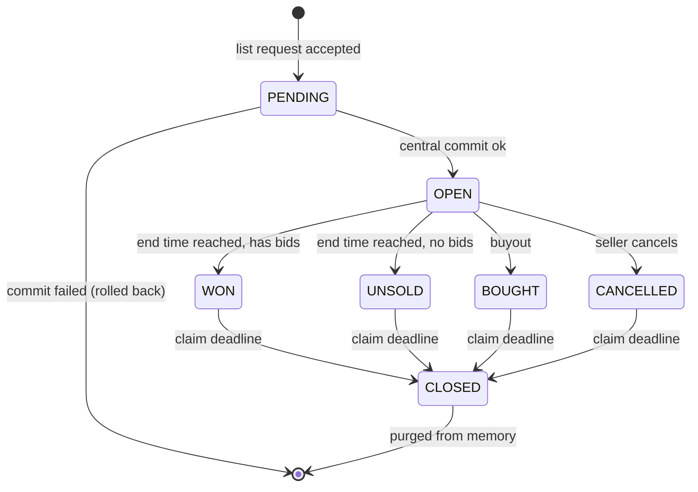

# Auction House — Design Specification

A complete, implementable specification of the Yogurting auction house: a
server-mediated marketplace where players list items for timed auctions, bid
against each other, optionally buy out instantly, and later claim their goods or
money from the auction desk.

This document is a design reconstruction written for the revival project. It is
self-contained: names for messages, fields, tables and constants are this
document's own, and any detail not stated here is left to the implementer. The
numeric values that are stated (fees, durations, page sizes, category codes,
state values) are the ones the original game used and should be preserved for
authenticity.

---

## 1. Overview

### 1.1 Player-facing model

- A player walks to an **auction kiosk NPC**, which opens the auction window.
  The window is a full-screen UI; the character stays in the world but the
  session is flagged as "in the auction" until the window closes.
- The window has three tabs: **Purchase** (browse everyone's listings),
  **Sale** (my listings), **Bid** (listings I have bid on).
- Listing an item costs a **non-refundable listing fee** paid up front, and the
  item leaves the seller's inventory immediately.
- A listing runs for a fixed **duration** chosen at listing time: **6, 12 or 24
  hours**. There is no auto-extension.
- Bidding is **ascending, escrowed and single-slot per bidder**: your money is
  taken when you bid and held until the auction ends. Raising your own bid only
  charges the difference. Losing bidders are *not* refunded when outbid — they
  reclaim their money after the auction ends.
- A seller may set an optional **buyout price**. Any buyer can end the auction
  instantly at that price.
- Nothing is delivered automatically. After an auction ends, both sides must
  return to the kiosk and **claim** — the winner claims the item, the seller
  claims the proceeds, losing bidders claim refunds, and a seller whose auction
  went unsold claims the item back. Unclaimed goods are **forfeited** when the
  listing is purged (default 72 hours after it ends).

### 1.2 Why the design looks the way it does

Three properties drive most of the mechanics and should be kept if you want the
original's feel:

1. **Money is escrowed, never promised.** The system never has to "collect" from
   a player who logged off or spent their money — every bid is already paid.
2. **Delivery is pull-based.** Nothing is ever pushed into a player's inventory
   asynchronously, so the auction service never has to deal with a full
   inventory or an offline character. This is why the claim step exists, and why
   a claim can fail with "inventory full" and be retried.
3. **One global market.** Listings are shared across all world/field servers of
   a service, so the authoritative store is a central service, not a field
   server.

---

## 2. Architecture

Three roles. A single-process implementation can collapse them, but the split
matters for correctness and is worth keeping.

| Role | Responsibility |
|---|---|
| **Client** | UI only. All rules are re-checked server-side; client checks exist purely to avoid pointless round-trips. |
| **Field server** (game server the player is connected to) | Holds the **live auction book** in memory: all open listings and all unclaimed bids. Serves browse/search/list queries with no database access. Runs the expiry and close timers. Validates requests. |
| **Account service** (central, one per service/world group) | Authoritative for **character money and inventory** and for the **persisted auction book**. Every mutation (list, bid, buyout, claim) is committed here first, then applied to the field server's copy. Also fans out to the database and to the audit log stream. |

### 2.1 Startup

On field-server start, the account service pushes the entire book: every listing
that is not yet purged, plus every bid that has not yet been claimed. The field
server rebuilds its indexes, then immediately runs both the expiry and the close
sweep, so auctions that ended while the server was down are resolved at once.

Listings already purged are skipped; bids already claimed are skipped.

### 2.2 Two-phase mutation

Every state-changing operation follows the same shape:

```
client ──request──▶ field server
                    │  validate against in-memory book + cached money
                    │  mark listing "in flight"
                    ├──commit──▶ account service
                    │            deduct money / remove item / update book
                    │            persist (DB) + audit log
                    │◀──result──┤
                    │  apply to in-memory book, clear "in flight"
       ◀──response──┤  update the player's cached money
```

Consequences to design for:

- A listing being committed is **locked**: concurrent bids and buyouts on it are
  rejected with `ALREADY_PROCESSING`, and the expiry sweep skips it and retries
  on the next tick.
- The client's answer arrives only after the central commit. The original sent
  a response immediately only when validation failed *before* the commit;
  success responses came back on the commit path. Either is fine as long as the
  client can distinguish "rejected" from "still pending".
- If the central commit fails after money or items were already taken, the
  original had no compensation path and disconnected the character. **Do not
  copy this.** Make the account service the only place that moves money and
  items, and make its operation atomic (one transaction), so the field server
  can never be ahead of it.

---

## 3. Data model

### 3.1 Listing

| Field | Type | Notes |
|---|---|---|
| `listing_id` | uint64 | Globally unique, see 3.3. Primary key everywhere. |
| `category` | int32 | Derived filter code, see §5. Assigned by the server at listing time, never sent by the client. |
| `item` | item snapshot | Full item record: type id, category, unique id (for equipment), stack count, and any per-instance data such as upgrade/enchant slots. The auction stores the item itself, not a reference to an inventory slot. |
| `seller_id` | int32 | Character id. |
| `seller_name` | string(≤ char-name max) | Denormalized for display. |
| `current_price` | money (int64) | Starting price at creation; thereafter the highest bid. |
| `buyout_price` | money (int64) | `0` = no buyout. |
| `top_bidder_id` | int32 | `0` = no bids yet. |
| `top_bidder_name` | string | Denormalized for display. |
| `state` | uint8 | See §4. |
| `claimed` | uint8 | Seller-side claim flag: `0` unclaimed, `1` claimed. One flag suffices — a listing ends in exactly one seller-side outcome (item back *or* proceeds). |
| `end_time` | timestamp | **Dual-purpose:** while `OPEN` it is the auction end time; once the auction ends it is overwritten with the **claim deadline**. |
| `duration_hours` | uint8 | 6, 12 or 24. Kept for display of the seller's own listings. |

### 3.2 Bid

One record per (listing, bidder). A bidder never has two rows on one listing.

| Field | Type | Notes |
|---|---|---|
| `listing_id` | uint64 | |
| `bidder_id` | int32 | Composite key with `listing_id`. |
| `bidder_name` | string | Denormalized. |
| `amount` | money (int64) | **Total** currently escrowed by this bidder for this listing (not the last increment). |
| `state` | uint8 | See §4.2. |
| `claimed` | uint8 | Bidder-side claim flag. |

### 3.3 Listing id

A 64-bit value composed at creation from:

```
listing_id = (server_id, server_incarnation, monotonic_counter)
```

`server_incarnation` is a per-process run counter, so ids stay unique across
restarts without reading the database. Any scheme with the same property works;
what matters is that ids are unique service-wide and monotonically increasing
per server, because **browse order is listing-id order** (§6.2).

### 3.4 Persistence

Two tables mirror the two records. Suggested columns, in the order the original
loader read them (useful only as a sanity check on completeness):

**`auction`** — `listing_id`, `category`, `item_type_sn`, `item_category`,
`item_unique_id`, `item_count`, `current_price`, `buyout_price`, `seller_id`,
`seller_name`, `top_bidder_id`, `top_bidder_name`, `state`, `claimed`,
`end_time`, `upgrade_slot_1..5`, `duration_hours`.

**`auction_bid`** — `listing_id`, `bidder_id`, `amount`, `state`, `claimed`.

Notes:

- `item_count` is meaningful only for stackable items; equipment carries a
  unique id instead.
- The five upgrade/enchant slot columns are the per-instance item data of the
  original's equipment. Generalize to whatever your item model needs, but note
  that the auction must round-trip **per-instance** item state, not just a type
  id — otherwise upgraded gear loses its upgrades in transit.
- Purged listings are kept in the table with `state = CLOSED` (they are simply
  not loaded at startup); an implementation may archive them instead.
- Every economic event should also be written to an append-only audit stream:
  listing created, bid placed, bought out, won, expired, cancelled, claimed —
  each with listing id, character id and amount. The original logged all of
  these, and for a live economy this is the only way to investigate item/money
  duplication.

---

## 4. State machines

### 4.1 Listing



Wire values (keep these — they are shared with the database):

| State | Value | Meaning |
|---|---|---|
| `PENDING` | 0 | Created, central commit in flight. Never visible to other players. |
| `OPEN` | 1 | Live and biddable. |
| `WON` | 2 | Ended with a winning bidder. |
| `BOUGHT` | 3 | Ended by buyout. |
| `CANCELLED` | 4 | Withdrawn by the seller. |
| `UNSOLD` | 5 | Ended with no bids. |
| `CLOSED` | 6 | Claim window over; purged. Nothing further is possible. |
| `ERROR` | 99 | Reserved for corrupt rows. |

`WON`, `BOUGHT`, `CANCELLED`, `UNSOLD` are collectively the **claimable**
states. `end_time` in those states means "claim deadline".

### 4.2 Bid

| State | Value | Meaning |
|---|---|---|
| `BIDDING` | 11 | An active or outbid bid. Refundable once the auction ends. |
| `WON` | 12 | This bidder won at auction end. Claims the item, not a refund. |
| `BOUGHT` | 13 | This bidder bought the listing out. Claims the item. |

A bidder's record moves `BIDDING → WON` when the sweep resolves the auction in
their favour, or `BIDDING → BOUGHT` when they buy out (their escrowed bid is
folded into the buyout total rather than refunded).

---

## 5. Category encoding

The browse filter is one integer, structured as `major * 1000 + minor`. The
server derives it from the item at listing time; the client sends it as a query.

| Major | Value | Minor meaning |
|---|---|---|
| Weapon — type A | 1000 | required grade 1–6 |
| Weapon — type B | 2000 | required grade 1–6 |
| Weapon — type C | 3000 | required grade 1–6 |
| Weapon — type D | 4000 | required grade 1–6 |
| Costume | 5000 | equip-slot **bitmask** |
| Consumable / upgrade material | 6000 | element 1–5, or 6 for "no element" |

Rules for deriving a listing's category:

- **Weapon:** major from the weapon class, minor = `max(item's required grade,
  grade required by any upgrade stone socketed in it)`, clamped to a minimum of
  1. Using the effective grade (not the base grade) matters: an upgraded low
  grade weapon must not hide in the grade-1 bucket.
- **Costume / other equipment:** `5000 + equip_slot_bit`. Slot bits are the
  item model's own equip-slot mask: head 1, back 4, hand 8, upper 64, lower 128,
  foot 256.
- **Consumable / upgrade material:** `6000 + element`, elements 1–5, `+6` when
  the item has no element.

Query codes the client may send:

| Query | Code | Matches |
|---|---|---|
| All weapons | `0` | any category in `[1000, 5000)` |
| All weapons of grade *g* | `1..6` | any weapon whose minor == *g* |
| A whole major bucket | `1000, 2000, … 6000` | `[code, code + 1000)` |
| Weapon class + grade | e.g. `3004` | exact match |
| Costume slot | `5000 + bit` | costume listings where `(query_bits & listing_bits) == query_bits` |
| All costumes | `5512` | treated as `5000` — the "all slots" pseudo-bit `512` is a UI convention, not a real slot bit, so it must be special-cased to the whole bucket |
| Consumable by element | `6000 + e` | exact match |

Valid query range is `0..6999`; reject anything outside it.

---

## 6. Server rules

### 6.1 Listing an item

Validate, in order:

1. `start_price > 0`.
2. `buyout_price == 0` (no buyout) **or** `buyout_price >= start_price`.
3. `duration_hours ∈ {6, 12, 24}`.
4. The seller actually holds the item (server-side inventory check, by unique
   id for equipment or by type+count for stacks).
5. The item type exists.
6. The item is **tradable**: not flagged no-trade, and — for equipment — not
   carrying a no-trade upgrade stone. (An item that is itself tradable can be
   made untradable by what is socketed into it.)
7. Stackables: `1 ≤ count ≤ 999`.
8. Only equipment, consumables and upgrade materials are listable; anything
   else (quest items, currency-like items, etc.) is rejected.

Then:

```
fee = floor(start_price × rate(start_price) × multiplier(duration))

rate(p)         = 0.04  if p <  100_000
                = 0.03  if p <= 1_000_000
                = 0.02  otherwise

multiplier(h)   = 1.00  for  6 h
                = 1.75  for 12 h
                = 2.50  for 24 h
```

Maximum possible fee is 10 % of the start price (4 % × 2.5). The fee is charged
against the seller's carried money, is **not refunded** on cancellation or
expiry, and is not deducted from the sale proceeds — a sale pays the seller the
full winning price.

Create the listing in `PENDING` with `end_time = now + duration`, commit to the
account service (which deducts the fee and removes the item), and on success
flip it to `OPEN` and index it. On commit failure, drop the listing entirely.

There is no cap on how many listings one character may have open. Add one if
you want to keep the browse list healthy.

### 6.2 Browsing and search

Three list modes:

| Mode | Returns |
|---|---|
| **Search** (Purchase tab) | `OPEN` listings matching a category query, paginated **11 per page**. |
| **My listings** (Sale tab) | All of my listings that are `OPEN`, or claimable and not yet claimed by me. Not paginated. |
| **My bids** (Bid tab) | Every listing I have an unclaimed bid on, paired with my bid record. Not paginated. |

Search ordering is **listing-id order** — effectively oldest first. There is no
sort by price or by time remaining. Pagination is done by walking the book and
skipping `11 × (page − 1)` matches; page 1 always succeeds (possibly empty), a
later page with no matches is an error so the client can stop paging.

A naive implementation scans the whole book per query; that was acceptable at
the original's scale but is O(listings) per keystroke-driven request. If you
expect a large book, keep a per-category index (major bucket → listing ids in id
order) and page over that.

**Text search:** the request carries a keyword field, but the original server
ignored it — the client filtered by item name *within the page it had already
received*, which means searching for a name only finds it if it happens to be on
that page. If you re-implement, either honour the keyword server-side (match
against the item's display name, and page after filtering) or drop the field.

### 6.3 Bidding

Reject unless all hold:

- The listing exists and is `OPEN` (else "expired/invalid").
- The listing is not currently in flight (else `ALREADY_PROCESSING`).
- `price > current_price`.
- If a buyout price exists, `price < buyout_price` — matching or exceeding the
  buyout must be done through the buyout action, not a bid.
- The bidder can afford the **charge**, where
  `charge = price − (my existing escrow on this listing, or 0)`.

Commit `charge` to the account service, then:

- First bid by this player: insert a bid record with `amount = price`, state
  `BIDDING`; it becomes the top bid.
- Raise: add `charge` to the existing record so `amount` becomes `price`; it
  becomes the top bid.

Set `current_price = price`, `top_bidder = bidder`.

Notes and gotchas:

- The escrow of previous, now-outbid bidders is **not** released. It stays until
  the auction ends and is claimed manually. This is deliberate (it is what makes
  the ledger self-consistent), and it is also the single most surprising rule
  for players — surface it in the UI.
- Because the top bid is simply the last accepted bid, there is no proxy/auto
  bidding and no minimum increment beyond "strictly greater". The client offers
  +5 %/+10 % steppers; the server accepts +1.
- The original did **not** stop a seller from bidding on their own listing (only
  the client blocked it). Enforce it server-side.
- There is no anti-sniping extension. A bid one second before the end simply
  wins. Add extension only if you deliberately want to change the feel.

### 6.4 Buyout

Reject unless: listing exists, is `OPEN`, is not in flight, and
`buyout_price > 0`. Charge `buyout_price − (my existing escrow, or 0)`.

On commit:

- `current_price = buyout_price`, top bidder = the buyer.
- The buyer's bid record (created if absent) becomes state `BOUGHT` with
  `amount = buyout_price`.
- Listing → `BOUGHT`, `end_time = now + claim_window`.
- Move the listing from the expiry queue to the close queue.

Other bidders' records stay `BIDDING` and become refund-claimable.

### 6.5 Expiry sweep

Runs every **20 seconds** over listings whose `end_time ≤ now`:

- Skip any listing currently in flight (retry next tick).
- Has a top bidder → listing `WON`; that bidder's record → `WON`.
- No bids → listing `UNSOLD`.
- In both cases set `end_time = now + claim_window` and move the listing from
  the expiry queue to the close queue.
- Notify the account service so the transition is persisted.

Yield periodically (e.g. after every 50 processed listings) so a large sweep
cannot stall the server thread.

### 6.6 Cancellation

A seller may withdraw a listing **only while it is `OPEN`** — including when it
already has bids, in which case all bidders get refund claims and the seller
gets the item back, having lost only the listing fee.

Set state `CANCELLED`, `end_time = now + claim_window`, move to the close queue.

⚠️ The original did **not** verify that the requester was the seller — any
client that knew a listing id could cancel it. Check ownership.

### 6.7 Claim

One request type with an action selector:

| Action | Value | Allowed listing states | Requires | Effect |
|---|---|---|---|---|
| Seller claims unsold/withdrawn item | 0 | `UNSOLD`, `CANCELLED` | requester is the seller; listing not yet claimed; free inventory space | item → inventory; `listing.claimed = 1` |
| Seller claims proceeds | 1 | `WON`, `BOUGHT` | requester is the seller; listing not yet claimed | `current_price` → money; `listing.claimed = 1` |
| Losing bidder claims refund | 2 | `CANCELLED`, `WON`, `BOUGHT` | requester has a bid record in state `BIDDING`, not yet claimed | `bid.amount` → money; `bid.claimed = 1` |
| Winner claims item | 3 | `WON`, `BOUGHT` | requester's bid is `WON` or `BOUGHT`, not yet claimed; free inventory space | item → inventory; `bid.claimed = 1` |

All four are rejected while the listing is `OPEN` or already `CLOSED`. A claim
that fails for inventory space must leave everything untouched so the player can
free a slot and retry — check space *before* the central commit.

### 6.8 Close sweep

Runs every **60 seconds** over claimable listings whose claim deadline has
passed. Claim window is **72 hours**. Closing purges the listing and all its bid
records from memory and marks them `CLOSED` in the database. Anything unclaimed
is **forfeited**.

This is harsh by modern standards. If you soften it, the natural alternative is
to mail unclaimed items and money to the owner instead of deleting them — but
note that this reintroduces exactly the asynchronous-delivery problem the claim
design was avoiding, so you need a mailbox system first.

### 6.9 Timing constants

| Constant | Value | Notes |
|---|---|---|
| Listing durations | 6 / 12 / 24 h | Also the fee multiplier tiers. |
| Claim window | 72 h | After the auction ends. |
| Expiry sweep | 20 s | |
| Close sweep | 60 s | |
| Page size | 11 | Matches the UI's row count. |

Build in a test/QA mode from the start: behind a config flag, reinterpret
durations in minutes and shorten the claim window to ~20 minutes, so a full
lifecycle can be observed in one sitting.

---

## 7. Protocol

Message names below are this document's; only the semantics and field sets
matter. All requests are client → server, all answers server → client.

### 7.1 Session

| Message | Fields | Notes |
|---|---|---|
| `auction.open` (server → client) | — | Sent as the kiosk NPC's dialog result. The client opens the window; the session enters "auction" state. |
| `auction.close` req/ans | — / `result` | Returns the session to normal field state without a map reload. |

### 7.2 Browsing

| Message | Fields |
|---|---|
| `auction.my_list` req | `list_type` (1 = my listings, 2 = my bids) |
| `auction.my_list` ans | `result`, `list_type`, `listings[]`, `bids[]` (bids only for type 2) |
| `auction.search` req | `category`, `keyword`, `page` |
| `auction.search` ans | `result`, `page`, `listings[]` (≤ 11) |

### 7.3 Trading

| Message | Fields | Server rules |
|---|---|---|
| `auction.create` req | `item`, `count`, `start_price`, `buyout_price`, `duration_hours` | §6.1 |
| `auction.create` ans | `result`, `listing_id`, `item`, `fee`, `money_after` | |
| `auction.cancel` req | `listing_id` | §6.6 |
| `auction.cancel` ans | `result` | |
| `auction.bid` req | `listing_id`, `price`, `client_time` | §6.3. `client_time` is advisory only — never trust it for ordering or expiry. |
| `auction.bid` ans | `result`, `listing_id`, `money_after` | |
| `auction.buyout` req | `listing_id` | §6.4 |
| `auction.buyout` ans | `result`, `item`, `money_after` | |
| `auction.claim` req | `listing_id`, `action` (0–3) | §6.7 |
| `auction.claim` ans | `result`, `action`, `money_after` | |

Every answer carries the player's resulting money where money moved, so the
client never has to recompute a balance.

An `auction.bid_notify` broadcast (listing id, bidder, new state) is worth
adding so open windows update live and outbid players find out. The original had
no such notification: the list only refreshed after your own actions, so you
discovered you had been outbid by looking.

### 7.4 Result codes

Implementation-defined numbering; the set matters.

| Code | Meaning |
|---|---|
| `OK` | Success. |
| `FAIL` | Generic rejection (bad parameters, not the owner, unknown listing). |
| `SEARCH_FAILED` | Requested page has no results. |
| `INSUFFICIENT_FUNDS` | Not enough money for the fee, bid difference or buyout. |
| `INSUFFICIENT_INVENTORY` | No free slot for the claimed item. |
| `CANNOT_CANCEL` | Listing is not `OPEN`. |
| `AUCTION_ENDED` | Listing is no longer in a state that allows this action. |
| `INVALID_AUCTION` | No such listing (already purged). |
| `INVALID_BID_PRICE` | Not above current price, or at/above buyout. |
| `NO_BUYOUT` | Buyout requested on a listing without a buyout price. |
| `UNLISTABLE_ITEM` | Item not tradable / wrong category / bad stack count. |
| `ALREADY_CLAIMED` | This side already claimed. |
| `ALREADY_PROCESSING` | Another bid or buyout on this listing is in flight. |
| `CLAIM_OK_ITEM_WON` / `CLAIM_OK_ITEM_BACK` / `CLAIM_OK_PROCEEDS` / `CLAIM_OK_REFUND` | Per-action success variants, so the client can show the right message and animation. |

---

## 8. Client specification

### 8.1 Window layout

One main frame with:

- **Action tabs** (radio): Purchase / Sale / Bid.
- **Category radios** (Purchase only): All weapons, weapon class A–D, Costume,
  Other — plus a second row of sub-filters that changes with the major choice:
  grades 1–6 for weapons, six equip slots for costumes, five elements + "none"
  for other.
- **Search box** with *Search* and *Search all* buttons.
- **Result list**: 11 rows, each showing item icon, item name, current price,
  buyout price, time remaining, and a context column — the seller's name on the
  Purchase tab, the top bidder or outcome on the Sale tab, and the bid status on
  the Bid tab.
- **Paging**: previous / next buttons and a `[page/total]` indicator.
- **Register** button (Sale tab) opening the listing form.
- An action sub-frame that switches between Bid, Buyout, List and Withdraw
  modes, plus a period-picker popup.

Rows whose corresponding claim has already been made are hidden.

### 8.2 Status column

| Status | Shown when |
|---|---|
| *Biddable* | Listing open, someone else is the top bidder |
| *Top bidder* | Listing open, I am the top bidder |
| *Won* | Ended, my bid won or I bought it out |
| *Sold to another* | Ended, someone else won |
| *Unsold* | Ended with no bids |
| *Withdrawn* | Seller cancelled |

### 8.3 Bid dialog

- The bid box opens pre-filled at **current price + 5 %**.
- Four stepper buttons: ±5 % and ±10 % **of the current price** (not of the
  displayed bid), with a floor of 1 unit so cheap items still step.
- Stepping down never goes at or below the current price.
- The value is clamped to the buyout price when one exists.
- *Bid* is disabled when I am already the top bidder, and when the remaining
  time has run out. *Buy now* is disabled when there is no buyout price.

### 8.4 List (sell) dialog

- Item picked from inventory; quantity for stacks.
- Start price, optional buyout price, duration picker (6/12/24 h).
- **Live fee preview** using the exact formula in §6.1 — the client must
  reproduce the server's rounding, or players will see a different number
  deducted than the one they were quoted.

### 8.5 Click behaviour

| Tab | Row state | Click does |
|---|---|---|
| Purchase | open, not mine | Opens the bid/buyout frame |
| Purchase | open, mine | Warning: cannot bid on your own listing |
| Purchase | ended | Warning: auction already finished |
| Sale | open | Opens the withdraw confirmation |
| Sale | unsold / withdrawn | Sends claim action 0 (item back) |
| Sale | won / bought | Sends claim action 1 (proceeds) |
| Bid | biddable / top bidder | Opens the bid frame |
| Bid | won | Sends claim action 3 (item) |
| Bid | lost / withdrawn | Sends claim action 2 (refund) |

Lock the list against further clicks between sending a claim and receiving its
answer — otherwise a double-click sends two claims and the second returns
`ALREADY_CLAIMED` noise.

After any successful action, refresh the current list from page 1.

---

## 9. Known weaknesses to fix in a re-implementation

Carrying the original's behaviour faithfully is the goal for feel, not for
these:

1. **Cancellation did not verify ownership.** Add the check.
2. **Sellers could bid on their own listings** server-side (client-only block).
   Add the check; self-bidding is the classic price-manipulation vector.
3. **Keyword search was never implemented server-side** — the client filtered
   the current page. Implement it properly or remove the field (§6.2).
4. **Bid editing/withdrawal was declared but not implemented.** Decide
   deliberately: escrowed ascending auctions normally do *not* allow retracting
   a bid, so the honest fix is to remove the message.
5. **No outbid notification.** Define and actually send the broadcast (§7.3).
6. **Failure after a partial commit disconnected the player.** Make the account
   service's operation atomic and return a clean error instead.
7. **Unbounded scans** for search and for index maintenance. Fine at small
   scale; index properly if you expect volume.
8. **No listing cap per character**, so one player can flood the book.
9. **Silent forfeiture** after 72 hours with no warning to the player. At
   minimum, show the claim deadline in the UI and warn on login.
10. **Price validation needs a real cap.** Pick one signed 64-bit money type
    and validate `0 < price ≤ cap` against something meaningful (e.g. the
    maximum a character can carry) rather than the type's own limit.

---

## 10. Minimum viable implementation order

1. Data model + persistence (§3), with the listing id scheme.
2. Listing creation with fee, escrow of the item, and the `OPEN` state.
3. Browse/search with paging (Purchase tab), and the Sale tab.
4. Bidding with escrow and re-bid difference.
5. Expiry sweep → `WON`/`UNSOLD`, and the claim actions (all four).
6. Buyout.
7. Cancellation.
8. Close sweep + forfeiture, audit log, and the QA time-compression flag.

Steps 1–5 are a complete, playable auction house; 6–8 complete the original's
feature set.
