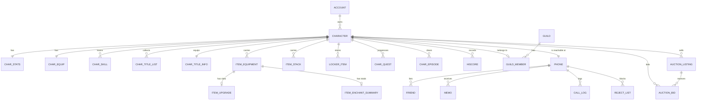

# Game State Database Schema (Tier 1)

The live per-character database of the original Yogurting service: characters,
inventory, quests, episode records, social systems, the auction book, and the
account-scoped premium state. This is the schema a server needs in order to run
the game — static content tables (episodes, monsters, NPCs, item types, skills,
fields) are covered by the companion
[static content schema](static-content-schema.md).

## How to read this document

**Confidence tag** on every table:

| Tag | Meaning |
|---|---|
| **verified** | Corroborated by two independent lines of evidence. Column names, order and types are reliable. |
| **documented** | Attested for an earlier revision of the schema (2004–2005) with no independent confirmation for the 2006 retail service. Probably still correct; treat sizes as approximate. |
| **recovered** | Absent from the earlier schema — reconstructed from how the 2006 retail service read and wrote the table. Column names and types are the ones it used; the *table* name and any column it never touched are inferred. |
| **inferred** | Shape deduced from behaviour and access patterns. Read the notes before implementing. |

**Types** are given in the original platform's terms (see §1). Where the earlier
schema and the 2006 retail service disagree, the 2006 value wins and the
difference is noted in §9.

**Descriptions** are English. The original Korean is kept in parentheses where
the term is game-specific and the translation is lossy (학년 = school grade,
별 = star / premium currency, 유찰 = unsold at auction).

---

## 1. Platform and conventions

- **Microsoft SQL Server** for the game and log databases. Types below are
  T-SQL: `int(4)`, `bigint(8)`, `tinyint(1)`, `smallint(2)`, `nchar(n)`,
  `datetime(8)`, `binary(n)`, `float(8)`. (The account/member database ran on
  Oracle; only the parts the game server reads are described in §8.)
- **All access is through stored procedures.** No server issues ad-hoc SQL.
  Procedure naming follows a strict convention that tells you the risk class of
  each call:

| Prefix | Class |
|---|---|
| `RP_` | Read (result set) |
| `WP_` | Write, single statement, no transaction needed |
| `TR_` | Write, multi-statement **transaction** (money and items move together) |
| `PS_` | Static content read (the other tier) |
| `XP_` | Maintenance / batch |

- **Identifier vocabulary**, used consistently across every table:

| Suffix | Meaning |
|---|---|
| `_sn` | Serial number — a surrogate identity key (`char_sn`, `user_sn`, `eps_sn`, `guild_sn`) |
| `_usn` | Unique serial number — a **globally unique 64-bit instance id** (`item_usn`, auction `usn`) |
| `_tid` | Type id — *what kind of thing this is*, encoded as `(category, type serial)`; see §3.2 |
| `_tsn` | Type serial alone, when the category is implied by the column |

- **Timestamps** appear in three forms and you must not mix them: `datetime`
  columns (log rows), 32-bit "game seconds" integers (`equipDate`,
  `guild_rdate`), and 64-bit filetime values that are sometimes stored as a
  single 8-byte column and sometimes split across two 32-bit columns
  (`eDateLowPart` / `eDateHighPart`). A re-implementation should normalize all
  three to a single UTC timestamp type.
- **Bulk parameters are binary blobs.** Transactional procedures take arrays of
  item records as fixed-size `binary(n)` parameters (e.g. a 12-byte item record,
  passed 5 or 20 at a time) with a separate count parameter. This is the single
  most hostile thing about the original schema to re-implement; see §10.
- **Character names** are `nchar(64)` in the earlier schema, but the retail
  service treated 32 wide characters as the limit. Use 32.

---

## 2. Subject areas

Six areas, described in order: character (§4), items and storage (§5), quests
and episodes (§6), social (§7), account-scoped premium state (§8), and the
auction book (covered by its own specification, summarized in §5.6).

---

## 3. Identity model

### 3.1 Account → character → phone

- `user_sn` (also `account_sn`) — the account. Owned by the account database;
  the game database only stores it as a foreign key.
- `char_sn` — the character. The primary key of nearly every table here.
- `phone` — a 7-digit in-game phone number assigned at character creation and
  **the key of the entire social layer**. Friends, memos, call logs and block
  lists are keyed by phone number, not by `char_sn`. Two consequences: the
  number must be unique service-wide (there is a dedicated uniqueness check
  procedure alongside the name check), and social data survives independently of
  character identity. Some tables carry both (`remote_csn` + `remote_phone`) so
  a renamed or deleted character still resolves.
- Reserved phone prefixes (`000`, `700`) are held in a small table and belong to
  NPCs and GMs, so player numbers can never collide with system senders.

### 3.2 Item identity

Two different ids, and mixing them up is the classic bug:

- **Type id** (`item_tid`) — encodes `(category, type serial)` in one 32-bit
  value. Category values: `1` money, `2` equipment, `3` consumable,
  `4` quest item, `5` upgrade material, `104` yogurt (stamina item),
  `105` premium item. (`0` = none.)
- **Instance id** (`item_usn`) — a 64-bit unique id, assigned only to
  **equipment**, because only equipment carries per-instance state (upgrade
  slots, enchant totals). Everything else is stored as `(char_sn, item_tid,
  count)` and has no instance identity.

This split is why the inventory is four or five tables instead of one, and why
the auction stores a full item snapshot rather than an item reference.

---

## 4. Character

### 4.1 `T_CHARX` — character core — **verified**

The row created at character creation; the identity and appearance record.

| Column | Type | Key | Meaning |
|---|---|---|---|
| `char_sn` | int(4) | PK | Character id |
| `user_sn` | int(4) | IX1 | Owning account |
| `name` | nchar(64) | IX2 | Character name (32 chars effective, unique) |
| `phone` | int(4) | IX3 | In-game phone number (unique) |
| `gender` | tinyint(1) | | 0/1 |
| `blood` | tinyint(1) | | Blood type — profile flavour |
| `birthMon` | tinyint(1) | | Birthday month |
| `birthDay` | tinyint(1) | | Birthday day |
| `tsnFace` | int(4) | | Face type |
| `tsnHair` | int(4) | | Hair type |
| `tsnSkin` | int(4) | | Skin type |
| `moneyHand` | bigint(8) | | Carried money — **widened from int(4)**, see §9 |
| `moneyBank` | bigint(8) | | Banked money |

The name and phone uniqueness checks are separate read procedures called before
creation, not constraints the client can see. Creation itself is one large
transactional procedure (31 parameters) that writes this row plus the stat,
equipment, inventory, hotkey and position rows, and returns the new `char_sn`
and assigned `phone`.

### 4.2 `T_CHAR_DSTAT` — progression stats — **verified**

Split from the identity row because it changes constantly during play.

| Column | Type | Key | Meaning |
|---|---|---|---|
| `char_sn` | int(4) | PK | |
| `school_sn` | int(4) | | Home school |
| `grade` | tinyint(1) | | School grade (학년) — the game's tier/rank axis |
| `level` | int(4) | | Level |
| `exp` | int(4) | | Experience |
| `hp` | int(4) | | Current HP (persisted so death state survives logout) |
| `baseHp` | int(4) | | Base max HP |
| `baseAtk` `baseDef` `baseHit` `baseFlee` `baseLuck` | int(4) | | Base stats: attack, defence, accuracy, evasion, luck |
| `pointMainQuest` `pointSubQuest` | int(4) | | Cumulative quest points — **dead columns**, already marked unused before launch |
| `cntReward1..6` | tinyint(1) | | Level-up stat-reward counters (how many times each stat was raised) |
| `cntRewardType1..6` | tinyint(1) | | Which stat each reward slot targeted |
| `dex_level_blade` `dex_level_glorb` `dex_level_mura` `dex_level_spirit` | int(4) | | Per-weapon-class mastery level — **recovered**, a post-2005 addition |
| `dex_exp_blade` `dex_exp_glorb` `dex_exp_mura` `dex_exp_spirit` | int(4) | | Per-weapon-class mastery experience — **recovered** |
| `skl_point` | int(4) | | Unspent skill points — **recovered** |
| `tutorial` | int(4) | | Tutorial completion flag/stage — **recovered** |
| `repos_sn` | int(4) | | Respawn/return field — **recovered** |
| `couponInvalidcnt` | int(4) | | Failed coupon-entry count (abuse throttle) — **recovered** |
| `couponExpireDate` | filetime | | Coupon lockout expiry — **recovered** |
| `spReward_sn` | int(4) | | Pending special reward — **recovered** |
| `spRewardTimeHigh` `spRewardTimeLow` | int(4) | | Its expiry, as a split 64-bit timestamp — **recovered** |
| `promoSupNum` `promoSupDate` | int(4) | | Promotion-support grant count and date — **recovered** |

Writes go through three generic single-parameter procedures — "set named stat
to value" for the dynamic, static and extended stat groups respectively — plus a
bulk episode-reward procedure that writes experience, level, all six base stats
and all twelve reward counters in one call. Grade promotion is its own
transaction (it touches the account database too).

### 4.3 `T_CHAR_SSTAT` — equipment and position — **verified**

| Column | Type | Key | Meaning |
|---|---|---|---|
| `char_sn` | int(4) | PK | |
| `usnWeapon` | bigint(8) | | Equipped weapon instance |
| `usnHead` `usnNeck` `usnBack` `usnHand` `usnTool` `usnRing` `usnUpper` `usnLower` `usnShoes` | bigint(8) | | Nine equipment slots, by item instance id |
| `field_sn` | int(4) | | Current zone |
| `posX` `posY` | int(4) | | Position within the zone (integer world units) |
| `setHotkey1..7` / `tsnHotkey1..7` | int(4) | | Hotkey bar — superseded, see §4.6 |

The retail service also carries a `type*` byte per slot alongside each instance id
(`typeWeapon`, `typeHead`, … `typeShoes`) — the item *category* of whatever is
in the slot, denormalized so the login path can resolve appearance without
joining the item tables.

Position is written by a lightweight procedure on zone change (`char_sn`,
`field_sn`, `posX`, `posY`) and current HP by an even smaller one. Both are
fire-and-forget writes queued from the cache tier.

### 4.4 `T_CHAR_LINFO` — character-select summary — **verified**

A denormalized projection used by exactly one screen: the character list at
login. It repeats name, phone, grade, gender, money, appearance types, the nine
equipped item *types* (`tsnHead` … `tsnShoes`, type ids not instance ids), the
school and the current field, plus the phone number split into head/tail
columns (`phoneHead` IX3, `phoneTail`) for prefix lookups.

Keeping this table is a deliberate trade: the select screen must render several
characters without touching the item tables at all. A modern implementation can
drop it and project from the character + equipment tables, at the cost of a
join per character.

### 4.5 `T_CHAR_USERINFO` — demographic record — **documented**

| Column | Type | Key | Meaning |
|---|---|---|---|
| `char_sn` | int(4) | PK | |
| `regionCode` | int(4) | | Region code carried over from the portal account |
| `gender` | char(1) | | `M` / `F` as reported by the account (distinct from the character's in-game gender) |
| `birthYear` | int(4) | | Birth year |
| `regDate` | datetime(8) | | Character creation time |

Written once at creation, from parameters the creation procedure receives. Exists
for age-gating and reporting, not gameplay. Drop it or replace it with whatever
your account system already knows.

### 4.6 `T_CHAR_HOTKEY_ITEM` / `T_CHAR_HOTKEY_SKILL` — **recovered**

The retail service loads hotkeys through two dedicated procedures, and the item
one returns **ten** slots as `(slot_kind, item_usn)` pairs where the earlier
schema had seven `(kind, type)` pairs inside the stat row. The bar was widened and
re-pointed at item *instances* rather than item types.

| Table | Columns |
|---|---|
| Item bar | `char_sn`, then `setHotKey1..10` int(4) + `usnHotKey1..10` bigint(8) interleaved |
| Skill bar | `char_sn`, `cateWeapon` int(4), `sklHotKey1..9` int(4) |

The skill bar is **per weapon class** (`cateWeapon`), so a character has one row
per class they have skills for — switching weapons switches bars. Whether these
live in their own tables or as widened columns on the stat row cannot be settled
from the access pattern alone; the write path updates only seven item slots, which
suggests the wide columns were added late and the writer was never updated —
worth treating as a bug to fix rather than a shape to copy.

### 4.7 `T_CHAR_SKILL` — learned skills — **recovered**

One row per learned skill: `char_sn`, `atk_sn` (skill id). Levels are not in
this table — skill purchase and level-up are separate transactional procedures,
so either the level lives in a column the login path does not read, or level is
derived from the static skill tree plus the point spend. Flagged as an open
question (§11).

### 4.8 `T_CHAR_RSTAT` — modifier stats — **recovered**

A generic key-value triple per character: `type`, `key`, `value` (all int(4)).
Used for stat modifiers whose shape was not worth a column — the read returns
every row for the character, and the server folds them into the live stat block.
This is the original's escape hatch for "we need one more number per character
without a schema change".

### 4.9 Titles — **verified** (extended)

Titles (호칭) are the game's achievement/label system.

`T_CHAR_TITLE` — the equipped title and the collection bitmaps:

| Column | Type | Meaning |
|---|---|---|
| `char_sn` | int(4) PK | |
| `title_sn` | int(4) | Currently equipped title |
| `equipDate` | int(4) | When it was equipped (game seconds) |
| `equipCnt` | int(4) | How many times titles have been swapped |
| `forced` | tinyint(1) | Title was force-equipped (penalty titles) |
| `expireTime` | int(4) | Force-equip release, as a wall-clock instant |
| `expireDuration` | int(4) | Force-equip release, as elapsed play time — the two coexist and whichever comes first wins |
| `isHold` | int(4) | Sanction id, if the character is under a naming penalty |
| `holdExpireTime` | int(4) | Sanction release |
| `groove` | int(4) | "Groove" points (짱 포인트) driving popularity titles |
| `get` | binary(32) | Bitmap of owned titles (256 titles) |
| `act` | binary(32) | Bitmap of active/visible titles |
| `param` | binary(64) | Opaque counter block for title progress |

The retail service addresses that `param` block as **typed slots** rather than one blob:
five 8-byte, five 4-byte, five 2-byte and five 1-byte counters. Same 64 bytes,
now addressable — the read side names them by width only, so what each counter
tracks lives in the title definitions, not here.

`T_CHAR_TITLE_LIST` — **recovered**: one row per owned title (`char_sn`,
`title_sn`, `active` tinyint), i.e. the bitmaps above normalized into rows. Both
exist in the retail service; the bitmaps are what the write path maintains, the row
list is what the login path reads. Pick one for a re-implementation — the rows.

---

## 5. Items and storage

### 5.1 `T_ITEM_BE` — equipment instances — **verified**

| Column | Type | Key | Meaning |
|---|---|---|---|
| `char_sn` | int(4) | IX | Owner |
| `item_tid` | int(4) | | Item type |
| `item_usn` | bigint(8) | PK | Instance id |

The only inventory table with instance identity. Ownership moves by updating
`char_sn`; the instance id never changes, which is what makes item logs and
auction listings traceable across owners.

### 5.2 `T_ITEM_CO` / `T_ITEM_EN` / `T_ITEM_QU` / `T_ITEM_YT` — stacks — **verified**

Four structurally identical tables, one per stackable class:

| Column | Type | Key | Meaning |
|---|---|---|---|
| `char_sn` | int(4) | PK | Owner |
| `item_tid` | int(4) | PK | Item type |
| `num` | int(4) | | Count (cap 999 per stack) |

- `CO` consumables (potions, food), `EN` upgrade materials (enchant stones),
  `QU` quest items, `YT` yogurt — the stamina/calorie item class (**recovered**;
  a post-2005 addition with its own read procedure).
- Stack count is capped at **999**; the auction and trade paths validate against
  the same constant.

### 5.3 `T_ITEM_BEX` — enchant summary — **documented**

Per equipment instance, the aggregate enchant state:

| Column | Type | Key | Meaning |
|---|---|---|---|
| `item_usn` | bigint(8) | PK | Equipment instance |
| `total` | tinyint(1) | | Total enchant count |
| `attrMain` | tinyint(1) | | Dominant element |
| `fire` `water` `wood` `steel` `earth` | tinyint(1) | | Per-element enchant counts (화 수 목 금 토) |

### 5.4 `T_ITEM_BE_RE` — upgrade slots — **recovered**

Per equipment instance, the five upgrade-stone sockets:
`item_usn` bigint(8) PK, `slot1..slot5` int(4) (stone type per socket, 0 = empty).

This is the table the auction house has to carry along with the item — a listing
snapshot includes all five slot values, and a re-implementation that stores only
`item_tid` will strip players' upgrades on sale. The parallel
`T_ITEM_BYUL_RE` (**recovered**) does the same for premium items and adds
`char_sn`, so premium upgrades are owner-scoped.

### 5.5 Locker — `T_LOCKER_ITEM_BE` / `_CO` / `_EN` — **recovered**

Shared account storage (사물함), added late (2005) and absent from the design
records. Three tables mirroring the inventory split:

| Table | Columns |
|---|---|
| Equipment | `char_sn` int(4), `locker_sn` int(4), `item_tid` int(4), `item_usn` bigint(8) |
| Consumables | `char_sn`, `locker_sn`, `item_tid`, `num` int(4) |
| Materials | `char_sn`, `locker_sn`, `item_tid`, `num` |

`locker_sn` identifies which locker (they were unlocked/rented, including with
premium currency), so one character can have several. Moves in and out are
transactional procedures that touch the inventory and locker tables together.

### 5.6 Auction — `T_AUCTION` / `T_AUCTION_BIDDING` — **verified**

The auction book. Full rules, state machine and protocol are in
[`../auction-system.md`](../auction-system.md); the storage shape is:

`T_AUCTION`: `usn` bigint(8) PK (listing id), `category` int(4),
`item_tsn` int(4), `item_ctg` tinyint(1), `item_usn` bigint(8), `item_num` int(4),
`cur_price` bigint(8), `max_price` bigint(8), `char_sn` int(4),
`char_name` nchar(32), `hbidder_sn` int(4), `hbidder_name` nchar(32),
`auc_state` tinyint(1), `rcv_state` tinyint(1), `edate` filetime,
`slot1..slot5` int(4), `period` tinyint(1).

`T_AUCTION_BIDDING`: `usn` bigint(8) PK, `char_sn` int(4) PK,
`bid_price` bigint(8), `bid_state` tinyint(1), `rcv_state` tinyint(1).

Note the item is **flattened into the listing row** — type, category, count and
all five upgrade slots — rather than referenced. That is what lets a listing
outlive its seller's session and still hand over the exact item.

### 5.7 Item movement procedures — **verified**

Every economic operation is one procedure, and the prefix tells you whether it
is transactional:

| Operation | Class | Parameters (beyond `char_sn`) |
|---|---|---|
| Acquire item | `WP_` | one 12-byte item record |
| Consume/delete item | `WP_` | one 12-byte item record |
| Use item | `WP_` | category, type, instance id, count |
| Acquire quest item | `WP_` | type, count |
| Use consumable | `WP_` | type, count |
| Set carried money | `WP_` | amount |
| Buy from NPC | `TR_` | price + up to 20 item records |
| Sell to NPC | `TR_` | price + up to 20 item records |
| Exchange (NPC swap) | `TR_` | items consumed + items granted (3 each) |
| Player-to-player trade | `TR_` | both character ids, both item lists (5 each), both money amounts |
| Refine | `TR_` | up to 20 consumed + 1 produced |
| Reinforce / upgrade | `TR_` | success flag, 3 consumed, 1 produced, 1 upgrade record |
| Premium upgrade | `TR_` | as above, premium variant |
| Random box open | `TR_` | box consumed + item granted |
| Locker in / out | `TR_` | item record |
| Episode loot box | `TR_` | up to 50 item records |
| Enchant summary update | `WP_` | item record + 8-byte enchant block |

The 12-byte item record is `(item_tid, item_usn, count)` packed; the counts are
what limits each operation (an NPC purchase is capped at 20 items, a trade at 5
per side).

---

## 6. Quests and episodes

### 6.1 `T_CHAR_QUEST` — quest progress

**documented** (2005): `char_sn` PK, `qst_sn` PK, `qst_usn` bigint(8),
`time` int(4) (acquired at), `cnt` int(4) (clear count), `flag` tinyint(1)
(counts toward grade promotion).

**recovered** (2006): the login read returns only `char_sn`, `qst_sn`, `clear`
(tinyint) — the instance id, timestamp and count are no longer read at login.
Either the table was simplified or the extra columns are written-but-never-read.
Implement the 2006 shape and add what you need.

Quest state changes are three transactional procedures — accept, resign, and
result — each carrying a 16-byte quest record plus item lists (up to 8 consumed
and 8 granted), because completing a quest atomically consumes turn-ins and
grants rewards. The result procedure also carries a character-parameter block,
which is how a quest awards stats.

### 6.2 `T_CHAR_EPISODE` — episode records

**documented**: `char_sn` PK, `eps_sn` PK, `num` smallint(2) (clear count),
`score` int(4) (best score), `flag` tinyint(1) (promotion credit).

**recovered**: the 2006 read returns `char_sn`, `eps_sn`, `state` (tinyint),
`score` — a `state` column replaced the clear count, so an episode is now
tracked as locked/available/cleared rather than by tally.

Episode completion is a transaction taking the episode id plus **parallel
arrays** for the whole party — up to 32 character ids, their scores, and their
promotion flags — in one call, so a party's records commit together.

### 6.3 High scores — **documented**

Per-episode leaderboards, one table per record type plus a team variant:

- `X_EPISODE_HISCORE_TYPE1[_TEAM]` — highest score
- `X_EPISODE_HISCORE_TYPE2[_TEAM]` — fastest clear
- `X_EPISODE_HISCORE_TYPE3[_TEAM]` — most potions used

Solo tables: `usn` bigint(8) PK, `date` datetime(8), `eps_sn`, `char_sn`,
`char_name` nchar(64), `char_grade`, `char_gender`, `score`, `vsflag`
(competitive mode). Team tables key on `(usn, char_sn)` and carry the member's
name, grade, gender and score — the run is the `usn`, the members are its rows.

`T_EPISODE_HISCORE` is a **derived** table (built at cache startup from the six
tables above) adding `cate` (all-time vs
recent) and `type` (which record). In a re-implementation this is a materialized
view, not a table.

---

## 7. Social

### 7.1 `T_FRIEND` — **verified**

`phone` PK, `friend_phone` PK, `friend_csn` int(4), `friend_name` nchar(64).
Keyed by phone on both sides, with the friend's character id and name
denormalized. One-directional rows: mutual friendship is two rows.

### 7.2 `T_MEMO` — offline messages — **verified**

`usn` bigint(8) PK, `phone` (recipient), `remote_csn`, `remote_phone` (sender),
`text`, `status` tinyint(1) (read/unread/kept). The earlier schema says
`nchar(200)`; the retail service used 100 characters — treat **100** as the limit.
Capacity is per phone and configurable (§7.4), and a maintenance procedure
clears guild-memo counters in bulk.

### 7.3 `T_PHONE_LIST` — call log — **verified**

`usn` bigint(8) PK, `phone` IX, `remote_csn`, `remote_phone`, `flag` int(4)
(incoming/outgoing). The in-game phone supported direct calls; this is the
history behind that UI.

### 7.4 `T_PHONE_OPTION` — phone capacity and privacy — **verified**

`phone` PK, `maxMemo`, `maxFriend`, `maxNameCard`, `optMemo`, `optFriend`,
`optNameCard`, `optCall`, `memChip` — all int(4). The `max*` columns are
per-character capacity limits (raised by premium purchases, which is why they are
data and not constants) and the `opt*` columns are privacy settings (who may
message/call you). `memChip` is the installed memory-chip item that grants the
extra capacity.

### 7.5 `T_PHONE_REJECT_LIST` — block list — **verified**

`phone` PK, `remote_phone` PK, `remote_csn`.

### 7.6 `T_PHONE_HEAD_RES` — reserved prefixes — **documented**

`phoneHead` int(4) — reserved number prefixes (`000`, `700`) for NPC and GM
senders. One row per reserved prefix; checked at character creation.

### 7.7 Guilds — `T_GUILD` / `T_GUILD_MEMBER` — **recovered**

Guilds (called clubs / 동호회 in-game) postdate the earlier schema entirely.

`T_GUILD`: `guild_sn` bigint(8) PK, `guild_odate` int(4) (founded),
`char_sn` int(4) (owner), `guild_name` nchar(12), `guild_mark` int(4) (emblem),
`guild_score` int(4), `guild_memo` int(4) (memo counter), `guild_member` int(4)
(member count), `guild_level` smallint(2), `guild_state` tinyint(1),
`guild_cdate` int(4) (state change date), `guild_board_sn` int(4) (web board
link).

`T_GUILD_MEMBER`: `char_sn` int(4) PK, `guild_sn` bigint(8),
`guild_rights` tinyint(1) (role/permission mask), `guild_rdate` int(4) (joined),
`guild_udate` int(4) (last left), `int_v1..int_v3` int(4) (generic
per-member counters — contribution, activity, and one spare).

The member read used at guild load also returns `guild_mark`, `char_phone` and
`char_name`, i.e. it is a join against the guild and character rows rather than
three separate reads. `guild_udate` on a *current* member row means members are
soft-removed and re-joined rather than deleted, so history survives.

Guild score has both a per-guild read and a batch collector procedure —
scores were recomputed periodically, not maintained incrementally.

### 7.8 `T_NOTICE` — scheduled announcements — **recovered**

`idNotice` int(4), `typeNotice` int(4), `startDay` int(4), `endDay` int(4),
`sNotice` nchar(150). Server-side scheduled notices with a validity window,
read at startup by the community server and broadcast on a timer.

### 7.9 Name cards

The in-game phone had a name-card (business card) feature with its own capacity
setting in §7.4, but there is **no name-card table** anywhere, and nothing
ever read or wrote one. Either cards were derived from the friend list, or the
feature was cut before it was persisted. Open question (§11).

---

## 8. Account-scoped premium state — **recovered**

Read from the account/member database at login, not the game database. One row
per account, driving the premium-currency features:

| Column | Type | Meaning |
|---|---|---|
| `BYUL` | int(4) | Premium currency balance (별 = star) |
| `curCalorie` | int(4) | Current calorie/stamina, stored ×100 |
| `perCalorie` | int(4) | Consumption rate multiplier |
| `tidYogurt` | int(4) | Active yogurt (stamina item) type |
| `eDateLowPart` / `eDateHighPart` | int(4) | Its expiry, as a split 64-bit timestamp |
| `accCalorie` | int(4) | Accumulated calories (statistics) |
| `freeSupNum` | int(4) | Free daily supply count remaining |
| `freeSupDate` | int(4) | When it last reset |
| `nbg_item_tsn` / `pbg_item_tsn` | int(4) | Equipped name-tag background items (normal / premium) |
| `picket_flag` | int(4) | Picket (player signboard) state |
| `picket_text` | nchar | Picket text |
| `bAlrimBPresent` / `bAlrimPPresent` | tinyint | Notification opt-outs for gifted currency / gifted products |

The calorie system is the stamina gate on episode play, and it is
**account-scoped, not character-scoped** — an important design choice to
preserve, since it stops alt-cycling around the stamina limit.

Premium *item ownership* lives in the billing database (a separate tier, ~42
tables covering products, categories, purchases, gifts, refunds and the website)
and is mirrored into the game as ordinary items of category `105`. The only part
a game re-implementation needs is: a balance, a purchase record, and a grant
path that creates a normal item row.

---

## 9. Schema evolution, 2005 → 2006 retail

The schema changed materially between 2005 and the 2006 retail service. Every
difference found, so nobody has to re-derive them — and so anyone working from
older data knows what to expect:

| Area | Earlier schema (2005) | Retail service (2006) |
|---|---|---|
| Money | `moneyHand` / `moneyBank` int(4) | **bigint** — widened. But the *write* procedures still take a 32-bit amount (see below) |
| Character name | `nchar(64)` | 32 characters effective |
| Memo text | `nchar(200)` | 100 characters |
| Guild name | — | `nchar(12)` |
| Hotkeys | 7 slots, `(kind, type)`, inside the stat row | **10** slots, `(kind, instance id)`, own read path; skill bar split out and keyed per weapon class |
| Quest row | `qst_usn`, `time`, `cnt`, `flag` | `clear` flag only on the read path |
| Episode row | `num` (clear count) | `state` (tinyint) replaces the count |
| Weapon mastery | absent | Four `dex_level_*` + four `dex_exp_*` columns |
| Skills | absent | Learned-skill rows + `skl_point` |
| Titles | `param binary(64)` | Same 64 bytes, addressed as typed counter slots; plus a normalized owned-title table |
| Locker | absent | Three tables |
| Auction | absent | Two tables |
| Guild | absent | Two tables + score batch |
| Yogurt items | absent | Own stack table |
| Premium upgrades | absent | Own slot table |
| Coupons, picket, name-tag backgrounds, tutorial, respawn point, special rewards, promotion support | absent | Columns on the character rows / account row |

**Real inconsistency worth fixing, not copying:** money is stored and read as 64-bit but
every write procedure that sets it (direct set, logout flush, NPC buy/sell
price) takes a 32-bit amount. A balance above 2.1 billion could be loaded but
not written back correctly. Auction prices are 64-bit throughout, so the auction
could legitimately produce a balance the character-write path could not persist.

---

## 10. Notes for a re-implementation

1. **Keep the identity split** (`char_sn` for state, item instance ids for
   equipment, phone number as the social key). It is what makes item history and
   the auction traceable. Do give phone numbers a real unique index.
2. **Do not copy the binary blob parameters.** They exist because the original
   needed to pass arrays to stored procedures. Use real transactions over
   ordinary rows and keep the operation boundaries: buy, sell, trade, refine,
   reinforce, quest result, episode clear and every locker/auction move must
   each be one atomic unit.
3. **One money type.** Signed 64-bit, everywhere, with a documented maximum and
   validation at both ends.
4. **Normalize the timestamps** (three representations in the original) and the
   title bitmaps (two representations of the same collection).
5. **Add the foreign keys the original omitted.** Nothing here is declared as a
   relationship — ownership is by convention, which is how orphan item rows
   happen.
6. **Drop the denormalized projections** (`T_CHAR_LINFO`, the derived high-score
   table, the per-slot type bytes) unless profiling says otherwise; they are
   1990s-era read optimizations.
7. **Keep the generic escape hatches** (`T_CHAR_RSTAT` key-value stats, the
   title counter block, the spare guild-member integers). They are what let the
   original ship features without schema migrations.
8. **Log every economic event** to an append-only store: listing, bid, trade,
   purchase, upgrade, grant. The original had a dedicated log database for
   exactly this, and without it item/money duplication is uninvestigable.

---

## 11. Open questions

1. **Skill levels** — learned skills are stored, but no level column is read at
   login. Is level derived, or written-but-unread?
2. **Name cards** — capacity and privacy settings exist; no table for them does.
3. **Hotkey storage** — separate tables or widened stat-row columns? The write
   path still updates only seven item slots against a ten-slot read.
4. **Bank money** — a column exists and is read, but no procedure in the game
   path writes it. Was banking ever live?
5. **`T_CHAR_LOG`** (character create/delete audit: `char_sn`, `user_sn`,
   `name`, `phone`, `type` 0=delete/1=create, `date`) belongs to the earlier
   schema only. The retail service routes character-lifecycle logging through the
   log database instead, so this table may be dead.
6. **Party** — a community-server feature with its own protocol but no
   persistence found. Parties were presumably session-only; confirm before
   designing a persistent party.
