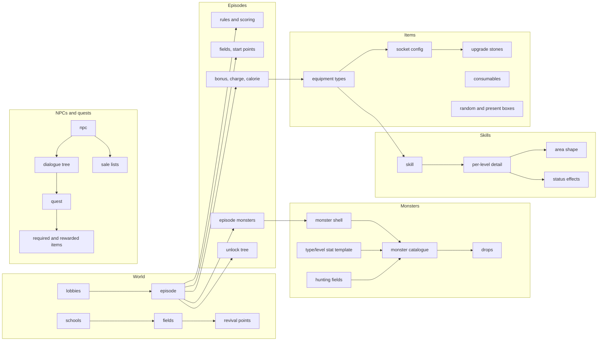

# Static Content Database Schema (Tier 2)

The content database of the original Yogurting service: the tables that define
*what exists in the world* — schools and fields, episodes, monsters, skills,
item types, NPCs and their dialogue, quests, progression curves, titles, and the
live-ops scheduling tables. Read-only at runtime, authored by designers, loaded
into memory when a server starts.

Companion to the [game state schema](game-state-schema.md), which covers the
per-character tables this content is applied to.

## How to read this document

Same confidence tags as Tier 1:

| Tag | Meaning |
|---|---|
| **verified** | Corroborated by two independent lines of evidence. |
| **documented** | Attested for an earlier revision of the schema (2004–2005), unconfirmed for the 2006 retail service. |
| **recovered** | Absent from the earlier schema — reconstructed from how the 2006 retail service read the table. Anything it never read is invisible here. |
| **inferred** | Shape deduced from behaviour and access patterns. |

Types are T-SQL (`int(4)`, `nchar(n)`, `float(8)`, `tinyint(1)`, `datetime`).
Descriptions are English, with the original Korean kept where the term is
game-specific.

Two shorthands used throughout to keep the tables readable:

- **`(itemCate, itemType, itemNum[, itemRate])`** — the *item reference tuple*
  that appears in ~20 tables. Category and type identify the item (§3.1); count
  is how many; rate, where present, is a drop/grant probability in 0…1.
- **`sn`** — the content id of the row's own entity (`eps_sn`, `npc_sn`,
  `qst_sn`, `mon_sn`); `asn` is an artificial row id where the natural key is
  composite.

---

## 1. Scale and shape

| | Earlier schema (2005) | Retail service (2006) |
|---|---|---|
| Content tables | 65 | **≈110** |
| Coverage | Episodes, monsters, items, NPCs, quests, titles, progression | All of the above, **plus** the rebuilt skill system, the monster catalogue and field hunting, upgrade sockets and stones, the in-game shop catalogue, vending machines, live-ops scheduling, and events/promotions |

Nothing was removed between the two, which makes the 2005 revision safe to use as
the *meaning* reference (it carries the designers' own Korean notes and every
enumeration) and the 2006 retail service as the *shape* reference.

### 1.1 How content is loaded

Every table is read once at server start through a dedicated read procedure
(`PS_T_<TABLE>`), most taking no parameter and returning the whole table; a few
take a scope key (episode id, school id, NPC field) and are called per scope.
The results are held in memory for the process lifetime.

There is **no hot reload**: changing content meant a server restart. Two
mechanisms soften that, and both are worth copying:

- **On/off switches in the data** — `T_EPISODE_STATE` toggles an episode
  live, `T_PRODUCT` has display/buy/gift flags with date ranges.
- **Scheduling tables** — §12 — which express "double calories on weekend
  evenings" as data with a time window, evaluated per request rather than baked
  in at load.

### 1.2 Formula columns

The single most important structural fact about this database: **many columns
hold expression strings evaluated by the server's script engine**, not numbers.

| Table.column | What it decides |
|---|---|
| `T_EPISODE.joinCond` | Whether a character may join an episode |
| `T_EPISODE_DETAIL.clearExpression` | The clear-score formula for a run |
| `T_EPISODE_MONSTER.hate` / `T_MON.hate` | Threat weighting for AI target selection |
| `T_EPISODE_MONSTER.skillActCond1..5` / `T_MON.sklcond1..5` | When a monster fires each skill |
| `T_NPC_ACTION_EX.act` | What an NPC does (up to 2048 chars of script) |
| `T_NPC_DIALOG_EX.selAct1..3`, `bgAct`, `closeAct` | What each dialogue choice does |
| `T_QUEST_EX.cond` | Whether a quest may be offered |
| `T_STATE_CHANGE.exp` | How a status effect modifies stats |

This is why the game could ship new episodes and quests as pure data. A
re-implementation needs an expression evaluator with the same variable
vocabulary (character stats, party size, elapsed time, kill counts, item
possession) before most of this content is usable at all — plan for it early
rather than hard-coding the shipped formulas.

---

## 2. Subject areas

---

## 3. Shared enumerations

These codes appear across dozens of tables. Getting them right once makes the
rest of the schema readable.

### 3.1 Item category (`itemCate`, `item_tcg`, `item_ctg`)

In *content* tables the designer-facing numbering is used:

| Code | Class |
|---|---|
| 1 | Money (타프 — the in-game currency) |
| 2 | Equipment (소지형 — instanced, equippable) |
| 3 | Consumable (소비형) |
| 4 | Quest item |
| 5 | Upgrade material (강화 — enchant stones and scrolls) |
| 6 | Yogurt (요구르트 — the calorie/stamina item class) |

⚠️ The runtime protocol uses a *different* numbering for the same concept
(money 1, equipment 2, consumable 3, quest 4, upgrade 5, yogurt **104**,
premium **105**). Content rows are authored in the table above; the server maps
them. Mixing the two is the single most likely porting bug in this tier.

### 3.2 Item silhouette (`silhouetteType`)

Icon/《shape》class: 1 money, 2 blade, 3 glove, 4 mura, 5 spirit, 6 clothing,
7–11 miscellaneous by element (fire, water, wood, metal, earth).

### 3.3 Item management flags (`manageType`) — bitmask

1 = cannot be traded, 2 = cannot be sold, 4 = may be placed on the quick bar.
Bit 1 is what the auction house and player trade check.

### 3.4 Equip part (`equipPart`) — bitmask

0 not equippable, 1 head, 2 necklace, 4 back, 8 hand, 16 tool, 32 ring,
64 upper body, 128 lower body, 256 shoes. The auction's costume filter reuses
these exact bits.

### 3.5 Swap part / swap type

`swapPart` (which body mesh the item replaces): 1 head, 2 face, 4 torso, 8 hand,
16 wrist, 32 thigh, 64 calf, 128 foot. `swapType`: 0 irrelevant, 1 swappable,
2 attachment. These are the fields that drive the avatar's model assembly.

### 3.6 Weapon class (`cateWeapon`)

0 not a weapon, 1 blade, 2 glove, 3 mura, 4 spirit (수호령). The game's four
combat styles; skills, super mode and the mastery levels are all keyed by it.

### 3.7 Weapon detail class (`idCateWeapon`)

Drives the basic-attack and idle animation set. Banded by weapon class:
**1xx blade** — 101 brute, 102 large/heavy, 103 short/light, 104 ordinary light;
**3xx glove** — 301 boxing, 302 martial, 303 claw, 304 heavy gear;
**5xx mura** — 501 classical dance, 502 jazz, 503 hip-hop, 504 folk.

### 3.8 School, grade, gender

School: 1 Estiva (에스티바), 2 Sowol (소월). Grade (학년) 1–6 is the game's
progression tier. Gender: 1 male, 2 female. Blood type (used only for character
creation defaults): 1 A, 2 B, 3 AB, 4 O.

### 3.9 Status effects (`exStatus`, `recStatus`) — bitmask

1 paralysis, 2 poison, 4 deadly poison, 8 aging, 16 excitation, 32 asthenia,
64 sealing, 128 death, 256 blessing, 512 great blessing. Equipment carries
resistances as seven separate `resist*` columns rather than a mask.

### 3.10 Skill targeting — bitmask

`effectiveTargetType` (who it affects): 1 self, 2 other monsters, 4 enemy-team
players, 8 same-team players, 16 active objects.
`enableTargetType` (what may be targeted): same bits, plus 12 = all players and
32 = a bare coordinate.

### 3.11 Time and season flags — bitmask

`existTime` / `condTime` (time of day): 1 before school, 2 class time,
3 = *combination*, 4 after school, 8 night. `condVaca` (holiday): 1 summer
break, 2 winter break, 4 spring break. NPC presence and lobby availability are
gated on these, so the campus population changes with the in-game clock.

---

## 4. World

### 4.1 `T_SCHOOL` — **verified**

`sn` PK, `fileName` nchar(32), `name` nchar(32), `BGM_sn`. Two rows shipped
(Estiva, Sowol). The retail service also exposes an "all schools" read used by tools.

### 4.2 `T_FIELD` — **verified**

`sn` PK, `fileName` nchar(32) **NN**, `name`, `description`, `BGM_sn`,
`npc_sn`, `dialog_sn`.

`fileName` is the map data file — this column is the join between the database
and the shipped terrain data, and is what a level tool needs in order to map a
field id to a map. `npc_sn`/`dialog_sn` give a field a default greeter.

### 4.3 `T_SCHOOL_FIELD` — **verified**

`asn` PK, `school_sn`, `field_sn`. Which fields make up a school campus.

### 4.4 `T_LOBBY` / `T_LOBBY_EPISODE` / `T_LOBBY_FIELD` — **verified** / **recovered**

Lobbies are the episode-matching rooms.

`T_LOBBY`: `lob_sn` PK, `name` nchar(28), `locDesc` nchar(128), `condVaca`,
`condTime` (§3.11), `roomNum` (how many rooms may exist at once), `bUse`
(listed on the notice board), `lobType` (0 normal, 1 special), `school_sn`.

`T_LOBBY_EPISODE`: which episodes can be started from a lobby.
`T_LOBBY_FIELD` (**recovered**): which fields a lobby occupies.

### 4.5 `T_REVIVAL_POS` — **recovered**

`repos_sn` PK, `field_sn`, `posX`, `posY`. Respawn points, referenced by the
character row's `repos_sn`. Not in the 2005 records — respawn was previously
tied to the episode's fail/escape position (§5.2).

### 4.6 `T_GUIDE_BOARD` / `T_GUIDE_BOARD_EPISODE` — **verified**

The campus notice board: `gb_sn` PK + `name` nchar(24), and a join table giving
each board an ordered episode list. This is the in-world UI for finding content.

---

## 5. Episodes

Episodes are the instanced content. Their definition is spread over a dozen
tables — one row in the head table, and everything else keyed by `eps_sn`.

### 5.1 `T_EPISODE` — head — **verified**

| Column | Type | Meaning |
|---|---|---|
| `eps_sn` | int(4) PK | Episode id |
| `name` | nchar(28) | |
| `desc` / `dispDesc` / `pcNumDesc` | nchar(1024/512/24) | Description, condition text, party-size text |
| `StartPointSelect` | int(4) | How characters are distributed over start points: 0 per-player random, 1 per-player sequential, 2 per-team random, 3 per-team sequential |
| `actCondGrade` | int(4) | Minimum grade (0 = any) |
| `actCondSchool` | int(4) | School restriction |
| `joinCond` | nchar(1024) | **Formula** — join eligibility (§1.2) |
| `leaveOpt` | tinyint(1) | May the run be abandoned |

The retail service reads the head and the detail row together through one wide
procedure (48 columns), so treat §5.1 and §5.2 as one logical record.

### 5.2 `T_EPISODE_DETAIL` — rules and scoring — **verified**

The rule sheet for a run. Grouped rather than listed one by one:

- **Exit placement** — three location modes (`clearLoc`, `failLoc`, `EscapeLoc`:
  0 = where you entered, 1 = the episode lobby, 2 = a specified spot) each with
  their own `field_sn`/`posX`/`posY`.
- **Mode and difficulty** — `modeType` (1 co-op, 2 competitive, 3 elimination,
  4 free-for-all), `level`, `pkOpt` (0 optional, 1 forced on, 2 forced off).
- **Party bounds** — `minPc`, `maxPc`, `minTeam`, `maxTeam`.
- **Scoring** — `clearExpression` (nchar(1012) **formula**), `basicScore`
  (the grading baseline), `failureScore` (the fail threshold), plus the
  real-time score weights `sbRate`, `monKillRate`, `bossDmgRate` and their caps
  `maxDamage`, `maxMonKill`, `maxSb`, `bossMaxHp`, and `clearPenalty` (a
  discount applied to points earned in an already-cleared field).
- **Pacing** — `minTime`, `avgTime`, `maxTime` (seconds), used both for scoring
  and for the fastest-clear leaderboard.
- **Resurrection** — `freeResurrect`, `totalResurrect`.
- **Latecomers** — `enterLimit` (progress fraction past which nobody may join).
- **Rewards tuning** — `bonusItemProbTarget`, `bonusItemProb`.
- **Restrictions** — `milkLimitOpt` / `milkLimitNum` (healing-item cap),
  `waitRoomOpt`, `clearExp`.

### 5.3 Composition tables — **verified**

| Table | Key | Contents |
|---|---|---|
| `T_EPISODE_FIELD` | `asn` | Which fields the episode uses (episode fields only) |
| `T_EPISODE_START_POINT` | `eps_sn`, `point_sn` | Start points with `field_sn` and `order` |
| `T_EPISODE_TREE` | `asn` | `eps_psn` → `eps_sn`: the unlock/parent tree |
| `T_EPISODE_PRINT_MSG` | `sn` | Scripted on-screen messages (nchar(100)) |
| `T_EPISODE_CLEAR_NPC_DIALOG` | `eps_sn` | NPC + dialogue played on clear |
| `T_EPISODE_CLUB` | `eps_sn` | `clearScoreRate` — fraction of clear score that becomes guild score |
| `T_EPISODE_STATE` (**recovered**) | `eps_sn` | `onoff` — live enable/disable switch |

### 5.4 Economy of a run — **verified**

- `T_EPISODE_CHARGE` — the entry cost, as item tuples (usually money).
- `T_EPISODE_BONUS` — the clear reward pool: item tuple + `itemRate`.
- `T_EPISODE_RATE` — scaling by party size: per `charNum`, an `itemDropRate` and
  a `bossHpRate`. This is how the game balanced solo versus full-party runs
  without duplicating content.
- `T_EPISODE_CALORIE` — `delay` before stamina starts draining, `consume` per
  minute, `enter` cost on entry.
- `T_EPISODE_CALORIE_PENALTY` — what running out costs you, banded by seconds
  spent at zero (`startTime`, `endTime` PK): attack-speed and move-speed rates,
  healing rate, added miss chance, reduced critical chance. A soft, staged
  penalty rather than a hard stop.
- `T_SCORE_BASE` — the score ladder used for grading.

### 5.5 Episode monsters — **verified** (extended)

`T_EPISODE_MONSTER` places and tunes a monster *for one episode*:
`sn` PK, `episode_sn`, `monBasis_sn` (the shell, §6.1), `name`, `maxHp`,
`maxSp`, `hpRegenRate`, `spRegenRate`, `baseAtk`, `baseDef`, `hit`, `flee`,
`luck`, `hateTarget` (bitmask: 1 players, 2 monsters, 4 objects), `hate`
(**formula**), five `skillActCond`/`skillActRate` pairs (**formulas** + percent),
`movPattern` (0 mobile, 1 stationary), `immortality`, `boss`. The retail service
adds `type` and `level`, linking each placement to the monster type/level stat
template (§6.3) instead of relying purely on the hand-entered stats.

`T_EPISODE_MONSTER_REWARD` — drops per episode monster: item tuple + rate.

`T_EPISODE_UNI_MON` (**recovered**) — unique/rare monster substitution:
`episode_sn`, `uniMon_sn`, `normalMon_sn`, `appear_prob`. A normal spawn is
replaced by a rare one with the given probability.
`T_EPISODE_UNI_MON_REWARD` (**recovered**) — `type`, `prob`, `value`: what
killing one grants (typed reward rather than an item tuple).

---

## 6. Monsters

The 2005 schema models monsters only as episode placements. The retail service
adds a full catalogue with reusable stat templates — the more useful design, and the
one to implement.

### 6.1 `T_MONSTER_BASIS` — the shell — **verified**

The physical/animation definition, shared by every monster that uses it:
`sn` PK, `effect` (persistent visual effect), `name`, `description`, `size`
(the footprint is `size × size`), `movSpeed1`/`movSpeed2` (walk/run),
`atkMotionTime`, `atkSpeed`, `flyDistDead` (knock-back distance on death),
`atkRange`, five `baseAtk_skillMon_sn*` (the basic-attack chain), five
`skillMon_sn*` (its skills), `battlePattern` (1 basic, 2 calls allies).

### 6.2 `T_MON` — the catalogue — **recovered**

`mon_sn` PK, `level`, `type`, `monbasis_sn`, `name` nchar(100), `hateTarget`,
`hate` (**formula**, nchar(500)), five `sklcond`/`sklrate` pairs, `movPattern`,
`immortality`, `boss`. Same AI shape as the episode placement, but reusable and
tied to a type/level rather than carrying its own stats.

### 6.3 `T_MON_TYPE` — stat template — **recovered**

`type` + `level` PK, then `pow`, `spd`, `skl`, `luck` (the four primary
attributes), `hp`, `atk`, `def`, `hit`, `eva`, `atk_spd`, `mov_spd`,
`cool_time`, `crit`, `exp`. One row per (archetype, level): a monster's stats
are looked up, not authored. This is the single biggest content-scaling
improvement between 2005 and 2006.

### 6.4 `T_MON_REWARD` — **recovered**

`mon_sn` + item tuple + `item_rate`. Catalogue-level drops.

### 6.5 `T_HUNT_FLD` / `T_HUNT_MON` — field hunting — **recovered**

Open-world spawning, absent from the 2005 records:
`T_HUNT_FLD`: `hfld_sn` PK, `fld_sn`, `areasize`, `overlapsize` (spawn area
grid and how much neighbouring areas overlap).
`T_HUNT_MON`: `hmon_sn` PK, `hfld_sn`, `mon_sn`, `regen` (respawn delay),
`num` (population). Combat outside episodes — this is what turned the campus
fields into huntable space.

---

## 7. Skills

### 7.1 The 2005 model — **documented**

`T_SKILL_WEAPON` was a flat list of player skills with everything on one row:
targeting, `castingTime`, `coolTime`, `spUsage` (in "uguu" gauge units),
`durationTime`, `range`, `areaX`/`areaY`, reference point, `atkRate` (damage =
base damage × rate / 100), `recHpType`/`recHp`.

`T_SKILL_MONSTER` is the same shape for monsters, minus casting time.
`T_SKILL_STCHANGE` attaches status effects to a skill with apply/remove
probabilities.

### 7.2 The 2006 model — **recovered**

The skill system was rebuilt around levelled skill trees. `T_SKILL_WEAPON`
shrank to the presentation/geometry core (`sn`, `name`, targeting, `range`,
`atkRate`, `skillframe`, `skl_area_sn`) and four new tables carry the rest:

| Table | Columns | Role |
|---|---|---|
| `T_SKILL` | `skl_sn`, `cateWeapon` | Skill → weapon class |
| `T_SKILL_DETAIL` | `atk_sn` PK, `skl_sn`, `pre_atk_sn`, `grade`, `skl_lv`, `wea_lv`, `c_time`, `skl_atk`, `fee_sp`, `fee_taff`, `type` | One row **per skill level**: its prerequisite skill, the grade and weapon-mastery level required, cast time, attack power, gauge cost and **money cost to learn** |
| `T_SKILL_AREA` | `skl_area_sn`, `cell_cnt`, `radius` | Area-of-effect shape, shared between skills |
| `T_SKILL_PASSIVE` | `atk_sn`, `st_change_sn`, `stat_effect` | Passive skills as permanent status effects |
| `T_SKILL_ST_CHANGE` | `atk_sn`, `st_change_sn`, `duration`, `hit_rate`, `stat_effect` | Active status application with its own duration and chance |

`atk_sn` — the per-level skill id — is the value stored on the character
(learned skills, skill hotkeys) and sold by skill-vendor NPCs (§9.5).

### 7.3 Status effects — **verified**

`T_STATE_CHANGE`: `sn` PK, `name`, `duration`, `exp` (**formula**, nchar(500)),
then multiplier columns `hpRecV`, `movSpeedRate`, `atkSpeedRate`, `hitRate`,
`evaRate`, `uguuRate` (combo-gauge fill rate), `dmgRate`, and `monflag` (this
effect is for monsters).

`T_STATE_CHANGE_PROB`: per enchant element (§3.2 elements) and step, the
probability that an enchanted weapon procs its effect.

### 7.4 `T_SUPER_MODE` — **verified**

The combo-gauge payoff state, per (`cateWeapon`, `grade`): `durationTime` and
the boosts — `varAtkSpd`/`varMovSpd` as multipliers (3.0 = 300%), `addAtk`,
`addDef`, `addHit`, `addFlee`, `addLuck` as flat additions.

### 7.5 `T_MATCHING_BASIC_SKILL` — **verified**

Per weapon detail class (§3.7): `atkNum` (how many hits the basic chain has) and
six `skillWeapon_sn`/`time` pairs — the chain's motions and their play times.
This is what makes a "short light blade" feel different from a "large heavy"
one.

---

## 8. Items

### 8.1 `T_BEITEM_TYPE` — equipment types — **verified** (extended)

The largest content table (≈39 columns in 2006). Groups:

- **Identity** — `sn` PK, `fileName` (model/icon asset), `name`,
  `description` nchar(1024), `price`, `silhouetteType`, `manageType`.
- **Equipping** — `equipPart`, `swapPart`, `swapType`, `cateWeapon`,
  `idCateWeapon`.
- **Combat modifiers** — `atk`, `def`, `hit`, `flee`, `hitRate`, `fleeRate`,
  `luck`, `maxHp`, `hpRecRate`, `uguuGaugeRate`, `atkSpeed`, `movSpeed`,
  `range`.
- **Requirements** — `grade`, `gender`, `school`, and (2006) `level`.
- **Status** — `exStatus` plus seven `resist*` columns.
- **Granted skills** — `skillWeapon_sn1..3`.
- **2006 additions** — `dur` (durability), `slot_num` and `slot_sn`: how many
  upgrade sockets the item has and which socket configuration (§8.6) applies.

### 8.2 `T_COITEM_TYPE` — consumables — **verified**

Identity as above plus `effectDesc`, `usable`, and the effect block: `hpRec`,
`hpRecRate`, `recHpType` (0 over time, 1 instant), `cpPoint`, `recStatus`
(which status effects it cures, §3.9), stat deltas (`atk`, `def`, `hitRate`,
`fleeRate`, `maxHp`), `uguuGaugeChangeSpeed`, `aktSpeed` *(sic — the typo is in
the schema)*, `movSpeed`, `durationTime`.

### 8.3 `T_ENITEM_TYPE` — upgrade materials — **verified**

`sn`, `fileName`, `name`, `desc`, `effectDesc`, `price`, `class` (1 crystal,
2 scroll), `attr` (element 1–5), `grade` (step), `value` (crystal worth). The
retail service renames these to `classification` / `attribute` / `reinforceClass` /
`crystalValue` — same fields.

### 8.4 `T_QUEST_ITEM_TYPE` — **verified**

`sn`, `fileName`, `name`, `description`. Deliberately inert: quest items have no
stats.

### 8.5 `T_ITEM_YT_TYPE` / `T_ITEM_YT_FREENUM` — yogurt — **verified**

The stamina item class. `item_sn` PK, asset/name/description, `price`,
`manageType`, `usable`, `order` (auto-use priority), `calorieRec` (how much
stamina it restores), `sched_sn` → the schedule table (§12.2) that can scale it
by time of day. `T_ITEM_YT_FREENUM` holds the daily free-ration count.

### 8.6 Sockets and upgrade stones — **recovered**

The 2006 upgrade system, entirely absent from the 2005 records:

`T_SLOT` — socket configuration templates: `slot_sn` PK, `slot_type1..5`
(what kind of stone each socket accepts), `slot_remove_type1..5` (how/whether a
stone can be removed), `slot_num_max`.

`T_REINFORCE_STONE` — the stone catalogue (32 columns): `restone_sn` PK; the
requirements it imposes on the wearer (`school`, `gender`, `grade`, `level`, and
the four `dex_level_*` weapon-mastery levels); its bonuses (`add_pow`, `add_spd`,
`add_skl`, `add_luck`, `add_maxhp`, `add_regen`, `add_atk`, `add_def`,
`add_flee`, `add_hit`, `add_atk_spd`, `add_mov_spd`, `add_ctime`, `add_crit`,
`add_fbdmg`, `add_ragedmg`, `add_uguu`, `add_uguu_max`, `add_skldmg`); and where
it may be socketed (`slot_type`, `slot_remove_type`, `slot_weapon_cate`,
`slot_equip_part`).

The wearer requirements are what makes a socketed item untradable to a character
who cannot meet them — the check the auction house performs before accepting a
listing.

`T_ENCHANT_PROB` — success probability per enchant step (`step` PK, `prob`).

### 8.7 Boxes — **verified** / **recovered**

`T_RANDOMBOX_ITEM` (2005): a box type (`item_tsn` PK) with five inline
`(tcg, tsn, num, rate)` outcome slots. `T_RANDOMBOX_ITEM_EX` (**recovered**,
2006) normalizes the same thing into rows, lifting the five-outcome limit.
`T_PRESENTBOX_ITEM` (**recovered**) does the same for gift boxes (no rate — a
present box has fixed contents).

### 8.8 Premium item types — **verified** (extended)

`T_ITEM_BYUL_TYPE`: `item_tsn` PK, name/description, `managetype`, `expdate`
(validity window), `usenum` (charges), `useday`/`usemin` (duration in days /
minutes), `useval` (effect magnitude), `grade`/`gender`/`school` restrictions,
`effect_tsn`, and (2006) `level`.

Three **recovered** companions:
`T_ITEM_BYUL_BETYPE` — the equipment-stat block for premium *equipment*
(32 columns mirroring §8.1, including its own `slot_num`/`slot_sn`);
`T_ITEM_BYUL_PARAM_BOOST` — `effect_tsn`, `value` for boost-type effects;
`T_ITEM_BYUL_PARAM_ENCHANT` — `item_tsn`, `grade`, `step`, `prob`, `type`:
premium enchanting with its own probability curve.

### 8.9 `T_VENDING_MACHINE` / `_ITEM` — **recovered**

`T_VENDING_MACHINE`: `type` PK, `price` (one price per machine type).
`T_VENDING_MACHINE_ITEM`: `type`, item tuple, `product_num` (stock), `secret`
(the hidden/rare outcome flag). Campus vending machines as a gacha with a
visible line-up and a secret slot.

---

## 9. NPCs and dialogue

### 9.1 `T_NPC_EX` — **verified**

`npc_sn` PK, `fieldType` (1 school, 2 episode), `field_sn`, `name` **NN**,
`type` (NPC shell/model), `movSpeed`, `movType` (1 stationary, 2 patrol between
two points, 3 wander in a box), `buyingRate` (the fraction of an item's price
this NPC pays when buying from players), `existTime` (§3.11).

`T_SCHOOL_NPC` (**recovered**) is the 2006 read used for campus NPCs, with
`zoneType`/`zoneSn` in place of `fieldType`/`field_sn` and a `npcDialog_sn`.

### 9.2 `T_NPC_DIALOG_EX` — dialogue nodes — **verified**

`npc_sn` + `dialog_sn` PK, `text` nchar(256), `cutIn` (portrait id), `selDef`
(the default branch if the player just closes), three `selText` choices with
three matching `selAct` **formulas**, `bgAct` (clicking the background),
`closeAct` (the close button), and `qFlag` — the quest-dialogue role: 0 ordinary,
1 quest-offer list, 2 quest-turn-in list, 3 offer description, 4 turn-in
description, 5 hint.

Dialogue "trees" are therefore not a tree structure in the schema at all: each
node's branches are script expressions that decide what happens next. Powerful,
and completely opaque without the expression evaluator.

### 9.3 `T_NPC_ACTION_EX` — **verified**

`npc_sn` + `order` PK, `school`, `grade`, `act` nchar(2048) **formula**. An
ordered list of scripted behaviours per NPC, filtered by the viewer's school and
grade — this is how one NPC says different things to a first-year and a
sixth-year.

### 9.4 `T_NPC_DIALOG_ITEM_EXCH` — **verified**

`npc_sn` + `npcItemEx_sn` PK, then three source item tuples and three
destination item tuples. Fixed-recipe item exchange (turn these three in, get
these three back).

### 9.5 Sale lists — **verified** / **recovered**

`T_NPC_SALE_LIST_EX`: `npc_sn` + item tuple + `order` — the shop inventory.
`T_NPC_SALE_SKILL` (**recovered**): `npc_sn`, `atk_sn`, `order` — skill
trainers, selling the levelled skills from §7.2.

### 9.6 `T_SPECIAL_PHONE` — **verified**

`phone` PK, `name`, `npc_sn`, `dialog_sn`. In-game phone numbers that reach an
NPC instead of a player — the reserved-prefix numbers from the Tier 1 social
layer.

### 9.7 `T_MATCHING_HAIRSHOP` — **recovered**

`type`, `taff` (price in game currency), `gender`. The hair salon's price list.

---

## 10. Quests

### 10.1 `T_QUEST_EX` — **verified**

`qst_sn` PK, `fileName`, `name` nchar(24), `level` (suggested), `cond`
nchar(512) (**formula** — offer eligibility), `desc`, `guideDesc` (the objective
line), `guideBoardDesc` (notice-board text), `charSchool` / `gbSchool` (which
school's characters, and which school's board), then the dialogue wiring:
`giv_npc_sn` with `givDesc`/`givSucc`/`givFail_dialog_sn`, and `res_npc_sn`
with `resHint`/`resDesc`/`resSucc`/`resFail_dialog_sn`. `spReward_sn` links a
special reward (§11.5).

The offering NPC and the turn-in NPC are separate by design, and each has its own
success/failure lines — fetch-quest structure baked into the schema.

### 10.2 `T_QUEST_REF_ITEM` — **verified**

`quest_sn` + `type` + item tuple. `type` is the *when and which direction*:
1 granted on accept, 2 required on accept, 3 required at turn-in, 4 granted at
turn-in, 5 deleted at turn-in regardless of count. Five clean cases that cover
every fetch/escort/collection quest in the game.

### 10.3 `T_QUEST_EPISODE_ITEM` / `T_QUEST_ITEM_GIVEN_TYPE` — **verified**

Quest items that drop *inside* episodes: `qst_sn` + `eps_sn` + `qitemType` +
`qitemValue` + `givType_sn`.

The grant-rate table is unusually charming: `givType_sn` PK, then twelve float
columns — `Aplu`, `A`, `Amin`, `Bplu`, `B`, `Bmin`, … `Dmin` — the drop rate
**by the player's report-card grade on that run** (A+, A, A−, B+ …). Do better
in the episode, get more quest items.

`T_QUEST_MON_REWARD` (**recovered**) adds per-monster quest drops:
`qst_sn`, `mon_sn`, `item_type`, `item_cnt`, `item_rate`.

### 10.4 `T_QUEST_DIALOG_COND` — **verified**

`npc_sn` + `cate` (1 offer conversation, 2 turn-in conversation) + `order`,
then `condCate` (1 = match a quest id, 2 = match a count of listed quests),
`cond` (the value) and `dialog_sn`. Evaluated in `order` — the first matching
rule picks the dialogue. This is how an NPC greets you differently depending on
what you are carrying.

---

## 11. Progression and rewards

### 11.1 `T_LEVEL_CUM_EXP` / `T_DEXLV_CUM_EXP` — **verified** / **recovered**

`level` PK → `cumExp`. The experience curve as a lookup table. The 2006
weapon-mastery curve adds `expsec` (experience per second of use), and
`T_MIG_DEXLV` maps character level to a starting mastery level (a migration
table from when mastery was introduced).

### 11.2 `T_LEVEL_REWARD` — **verified**

Per level band (`termId` PK): `countRewards0..5` (how many times each reward
slot is granted in the band), `countRewardsType0..5` (which stat each targets:
HP, ATK, DEF, HIT, FLEE, LUCK) and `totalCountRewards`. The counters written
back on the character row (Tier 1 §4.2) are consumed against this table — level
rewards are deterministic and budgeted per band, not random.

### 11.3 `T_CHAR_ATTR` — **recovered**

`level` PK → `pow`, `spd`, `skl`, `luck`. The 2006 four-attribute model per
character level, matching the monster template in §6.3. The 2005 stat model
(HP/ATK/DEF/HIT/FLEE/LUCK) still exists on the character row, so the two
coexist: primary attributes drive derived stats.

### 11.4 `T_HP_REGEN_SPEED`, `T_EXP_RATE`, `T_EXP_RATE_PARTY` — **verified** / **recovered**

`T_HP_REGEN_SPEED`: per grade, the seconds to refill HP from zero.
`T_EXP_RATE` (**recovered**): per level difference between killer and victim, an
experience multiplier — the anti-power-levelling curve.
`T_EXP_RATE_PARTY` (**recovered**): per party size, an experience multiplier.

### 11.5 `T_SPECIAL_REWARD` — **verified**

`spReward_sn` PK, `type` (1 experience bonus, 2 attack bonus, 3 defence bonus,
4 item-drop-rate bonus), `value`, `duration`, `desc`. Temporary buffs granted by
quests, held on the character row as `spReward_sn` + expiry.

### 11.6 Promotion — **verified**

Grade promotion (진급) is the game's chapter break, and it is fully data-driven:

`T_PROMOTE_COND`: `sn` PK, `school_sn`, `grade`, `title`, `desc`, `dispCond`
(the goal as shown to the player), `condType` — 1 clear count of a specific
episode, 2 average score over a set of promotion episodes, 3 character stats,
4 quest items held, 5 clear count of a specific quest.
`T_PROMOTE_COND_DETAIL`: `sn` + `param` (currently the episode id) + `value`
(the required score) + `order`.
`T_PROMOTE_NPC`: which NPC and dialogue handle promotion, per school and grade.

### 11.7 Titles — **verified**

`T_TITLE`: `sn` PK, `name` nchar(10), `desc`, `condDesc` (how to earn it),
`forceEquip`, `priorityEquip` (which title wins when several apply),
`minEquip`/`hourEquip`/`dayEquip` (how long it stays equipped).

`T_TITLE_EFFECT`: `title_sn` + a three-level category (`cateL`, `cateM`,
`cateS`) + `value`. The taxonomy is worth reading in full because it shows what
titles could do: motion and effect swaps (sit animation, hit effect, persistent
aura), episode effects (invitation priority, no mid-run joining, no death
penalty, resurrection cost, experience change, score change, bonus drop rate),
campus effects (shop buy and sell price changes), item effects (potion recovery
speed), and combat effects (damage correction, money cost per basic attack,
attack, defence).

### 11.8 `T_CLUB_RIGHT` — **verified**

Per guild level: `score` needed to reach it, `memberNum` cap, `subMasterNum`
(vice-president slots), `memoNum` (guild messages per period), `markRights`
(emblem permission). The guild progression curve for the Tier 1 guild tables.

---

## 12. Live-ops and meta

### 12.1 Events and promotions — **recovered**

`T_EVENT`: `event_sn` PK, `start`/`end` datetime, `name`, `filename`, `desc`.
`T_EVENT_REWARD`: `event_sn` + audience filters (`school_sn`, `gender`, `grade`)
+ item reference. Time-boxed giveaways targeted at a slice of the population.

`T_PROMOTION` / `T_PROMOTION_REWARD`: `promotion_sn` + `name`, and typed
`(type, value)` rewards — the marketing-campaign equivalent.

### 12.2 Schedules — **recovered**

`T_SCHED_CALORIE` and `T_SCHED_ITEM_YT` share one shape (18 and 15 columns):
`sched_sn` PK, `sched_name`, `sched_key`/`sched_val`, `sched_sdate`/`sched_edate`
(the campaign window), `calorieRate` (the multiplier), then the recurrence:
`sched_week` (day-of-week mask), `sched_mday10`/`20`/`30` (day-of-month masks in
three ten-day buckets), and **two** hour windows `sched_shour1`/`ehour1`,
`sched_shour2`/`ehour2` — so "weekday lunchtime and evening" is one row. The
calorie variant adds audience filters `sched_dest`, `sched_school`,
`sched_grade`.

A small, complete cron-in-a-table. If you build live ops, copy this design.

### 12.3 In-game shop catalogue — **recovered**

`T_PRODUCT`: `product_id` PK, `name`, `regdate`/`startdate`/`enddate`,
`dp_option` (display style — the HOT/NEW/UPDATE badges), `canbe_display`,
`canbe_buy`, `canbe_present`, `canbe_directpay`, `valid_sex`, `valid_school`,
`buy_type`, `price`, `cp_rate_id`, `pccafe` (available to internet-café
accounts).
`T_CATEGORY`: `cat_id`, `cat_kind`, `name`, `status`, `regdate`.
`T_CATEGORY_PRODUCT`: `cat_id`, `product_id`, `dp_order`.

This is the *game-side mirror* of the billing catalogue — enough to render the
shop and validate a purchase; the money side lives in the billing database.

### 12.4 `T_PCCAFE_POTION` — **recovered**

`repeat_limit`, `grade`, item tuple. The internet-café perk: a free item
grant, capped per period and gated by grade. A period-specific feature of the
Korean market that a modern reconstruction will probably drop.

### 12.5 Text and moderation — **verified** / **recovered**

`T_MSG_TEXT`: `sn` PK, `text` nchar(100) — server-side message strings
referenced by content rows (so a designer could change a message without a
build).
`T_TABOOWORD` (**recovered**) and `T_CURSE` (**recovered**, `curse` nchar(200)
+ `type`): the banned-word and profanity lists, loaded at startup and applied to
chat, character names, guild names and picket text.

### 12.6 Character creation defaults — **verified**

Three tables keyed by (`school_sn`, `gender`, `bloodType`) — the game asks for
blood type at creation and actually *uses* it:

- `T_CHAR_CREATE_EPISODE` — the tutorial episode a new character starts in.
- `T_CHAR_CREATE_ITEM_INFO` — the starting inventory, one row per item, with
  `bEquip` and `bHotKey` flags (at most one of each).
- `T_CHAR_CREATE_POS_INFO` — the starting field and position.

---

## 13. What changed between 2005 and 2006

| Area | Change |
|---|---|
| Monsters | Episode-embedded placements → a catalogue (`T_MON`) with per-(type, level) stat templates (`T_MON_TYPE`), catalogue drops, and field hunting (`T_HUNT_FLD`/`_MON`) |
| Skills | Flat skill list → skill trees with per-level rows, prerequisites, mastery and grade gates, gauge and money costs; area shapes and passives split out |
| Attributes | HP/ATK/DEF/HIT/FLEE/LUCK only → four primary attributes (pow/spd/skl/luck) per level, plus per-weapon mastery levels and their own experience curve |
| Equipment | Fixed stats → durability, level requirement, and upgrade sockets (`T_SLOT`) filled with stones (`T_REINFORCE_STONE`) that carry their own wearer requirements |
| Premium items | One type table → equipment stat block, boost parameters and an enchant probability curve of their own |
| Episodes | Static rules → live on/off switch, unique-monster substitution, and party-size scaling |
| Live ops | None → events, promotions, two scheduling tables, an in-game shop catalogue, internet-café perks |
| Moderation | None → banned-word and profanity tables |
| Boxes | Five inline outcomes → normalized outcome rows, plus present boxes |
| Respawn | Episode-relative only → named revival points |

---

## 14. Notes for a re-implementation

1. **Build the expression evaluator first** (§1.2). Roughly a dozen columns
   across the most important tables are script, not data. Without it you can
   load this schema but not run an episode, offer a quest, or drive monster AI.
2. **Keep the item reference tuple** `(category, type, count, rate)` as one
   composite type. It appears in ~20 tables and normalizing it away in some
   places but not others is how inconsistencies start.
3. **Fix the category numbering** (§3.1) — one enumeration, used by both content
   and runtime. The original's two-numbering scheme is a bug generator.
4. **Prefer the 2006 model** wherever the two disagree: type/level stat
   templates over hand-authored monster stats, normalized reward rows over
   inline five-slot columns, per-level skill rows over flat skills.
5. **Content ids are the public API** of this database. Fields reference map
   files by name, items reference model files by name, skills reference
   animation frames. Any renumbering breaks the shipped client data — treat
   `sn` values as immutable.
6. **Add the missing constraints.** Nothing here declares a foreign key, and a
   large fraction of content bugs in a game like this are dangling references
   (an episode pointing at a deleted field, a drop table pointing at a removed
   item). Validate at load and refuse to start.
7. **Keep the scheduling design** (§12.2) — it is compact, expressive, and the
   part of this schema that has aged best.
8. **Localization**: text lives inline in the content tables (names,
   descriptions, dialogue), with only `T_MSG_TEXT` factored out. If a
   re-implementation wants more than one language, that is a schema change, and
   it is cheaper to make it before importing content than after.

---

## 15. Open questions

1. **`T_EPISODE_INFO` vs `T_EPISODE` + `T_EPISODE_DETAIL`** — the retail service
   reads a single 48-column result. Whether the tables were merged or the
   procedure joins them cannot be settled from the access pattern alone.
2. **`T_MON` vs `T_EPISODE_MONSTER`** — both exist in the retail service, and episode monsters
   gained `type`/`level` columns. Did episode placements start deriving their
   stats from the templates, with the hand-entered stats kept as overrides, or
   were both paths live?
3. **`T_SKILL_STCHANGE` vs `T_SKILL_ST_CHANGE`** — near-identical names, both
   present in 2006. Probably old and new; confirm before implementing.
4. **`T_EPISODE_ALL` / `T_SCHOOL_ALL`** — thin "list everything" reads with a
   `class` and `startRule` column not present elsewhere. Likely tool-facing
   views rather than tables.
5. **`T_MATCHING_HELP`**, an NPC guide table added in 2004, has no read path in
   the retail service — probably cut.
6. **Sound and effect ids** (`BGM_sn`, `effect`, `cutIn`) reference resources
   that are not in this database. The mapping lives in the client data.
