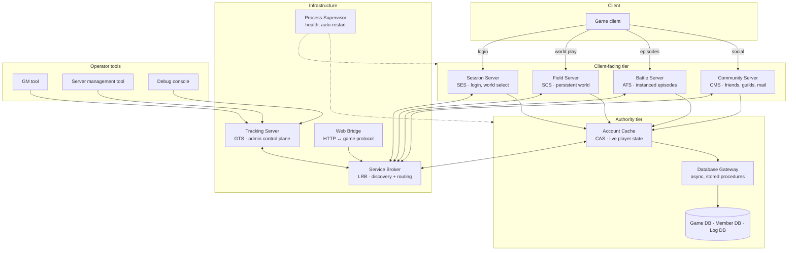

# Server Architecture

How the original Yogurting service was put together: which server processes
existed, what each one owned, how they found and talked to each other, and how a
player's session moved through them.

Read this before [`LEGACY_PROTOCOL.md`](LEGACY_PROTOCOL.md) — that document
describes the packets, this one describes who is sending them and why. Component
names below are role names; where the wire protocol has an established
abbreviation for a component, it is given in parentheses so the two documents
can be cross-referenced.

---

## 1. Shape of the service

Yogurting launched in 2006 as a Korean action MMO with a hybrid structure: a
persistent social world (the school campus) plus instanced action content
(episodes). The server side mirrors that split, and the rest of the topology
exists to support it.

Characteristics of the era that explain most of the design:

- **One process per concern.** Roughly a dozen distinct server programs rather
  than one monolith, each single-purpose and independently restartable.
- **IOCP-based C++ on Windows**, thread-pool per process, with a custom binary
  protocol over raw TCP for both client and server-to-server traffic.
- **An in-memory authority tier in front of the database.** A relational
  database (Microsoft SQL Server for the game and log databases; the account
  database was Oracle, and the gateway supports both) sits behind a gateway and
  is reached almost exclusively
  through stored procedures; live player state lives in a dedicated cache
  process, and writes are asynchronous.
- **A message broker for service discovery and routing**, so processes address
  each other by *service* rather than by host and port.

### 1.1 Topology

### 1.2 Component inventory

| Component | Tier | Default port | Owns |
|---|---|---|---|
| **Session Server** (SES) | client-facing | 10000 | Authentication, world list and selection, duplicate-login prevention, login queue, handoff to a field server |
| **Field Server** (SCS) | client-facing | 10002 | The persistent world: movement, zones, NPCs, chat, interactive field objects (kiosks, lockers, vending machines), warps |
| **Battle Server** (ATS) | client-facing | 10001 | Instanced episodes: rooms, combat, skills, monster AI, scoring and rewards |
| **Community Server** (CMS) | client-facing | 10004 | Friends, guilds, offline mail, party, profile cards, announcements |
| **Account Cache** (CAS) | authority | — | Authoritative live player state (character, inventory, money, skills) and world-level state (guilds, auction book, rankings); async persistence |
| **Database Gateway** | authority | — | Thread-pooled asynchronous database access; all reads and writes as stored-procedure calls |
| **Service Broker** (LRB) | infrastructure | 12346 | Service registration, discovery and message routing; replicates its routing table to peer brokers |
| **Tracking Server** (GTS) | infrastructure | 11027 | Admin control plane: server health, world state, player lookup, announcements, IP allow-listing |
| **Process Supervisor** | infrastructure | — | Per-host process health reporting, metrics, automatic restart |
| **Web Bridge** | integration | — | HTTP ↔ game protocol: website auth, item grants from external systems |
| **Script VM** | library | — | Bytecode scripting engine embedded in the game servers (quests, dialogue, triggers) |
| **Operator tools** | tools | — | GM tool, server management tool, debug console — all speaking to the tracking server |

Not every component is a separate deployment concern: the script VM and the
shared game-logic and protocol-definition layers are libraries linked into the
servers, not processes.

---

## 2. Client-facing servers

### 2.1 Session Server (SES)

The only endpoint the client knows up front. It authenticates, then hands the
client onward — it is a gateway, not a game server, and holds no gameplay state.

Responsibilities:

- Authenticate credentials (both against the game's own account tables and,
  in operation, against an external publisher authentication service).
- Serve the world list with per-world status (online/offline, population,
  "crowded" flags) and take the player's world selection.
- Detect duplicate logins across the whole cluster and evict the older session.
- Queue clients when the target world is at capacity.
- Complete the handoff: the "join game" answer carries the address of the field
  server the client should connect to next.

Login sequence (message names in the protocol document):

1. authenticate → 2. world list → 3. select world → 4. join game *(returns the
field server address)*.

### 2.2 Field Server (SCS)

Hosts the persistent world where players walk around, talk, shop and organize.
This is the server the level/map data describes.

Responsibilities:

- Movement and position validation, and synchronization to nearby players.
- Zone (field) containers, each with its own entity set and interest management.
- NPC dialogue, interactive field objects — the auction kiosk, lockers, vending
  machines, shops — and warps between zones.
- Chat and slash commands.
- Coordinating every inventory/money mutation with the account cache.

**Interest management (AOI).** Each zone maintains a grid; a player receives
updates only for entities inside their "show range", and broadcasts are issued to
that range rather than to the zone. This is the single most important scaling
mechanism on this server, and any re-implementation needs an equivalent before
population grows.

**Per-client state machine.** The connection carries a coarse state that gates
which messages are legal: in-field, in-NPC-dialogue, loading a zone, dead, and
one state per exclusive UI session (auction window, locker, shop, trade, …).
Entering such a UI moves the session out of the plain field state and back again
on close, without a zone reload. Treat these states as an authorization table:
"is this message even accepted right now" is the cheapest anti-cheat there is.

### 2.3 Battle Server (ATS)

Runs the instanced content — episodes (dungeons), plus PvP battles — as
short-lived sessions with their own lifecycle, separate from the persistent
world.

Responsibilities: room/session hosting and matchmaking handoff, hit detection
and damage resolution, the skill and status-effect system, monster spawning and
AI, loot and reward distribution, and interest-managed state sync (the same AOI
approach as the field server).

Episode lifecycle: **waiting for players → load wait (clients loading assets) →
in progress → scoring → ended**. The load-wait phase is explicit and worth
copying: clients report readiness, and gameplay does not start until all of them
have, so nobody spawns into a running fight.

Combat model, in brief: attacks resolve server-side (player→monster and
player→player paths), damage is computed from attack versus defence with the
usual hit/evade rolls, and a chain-combo gauge builds up from consecutive hits
to unlock a heightened state. Skills come in active, passive and
status-modifying flavours.

### 2.4 Community Server (CMS)

Everything social that must outlive a play session, kept out of the game servers
so it survives their restarts and works across worlds: friend lists with online
status, the guild system (creation, membership, levelling, scoring), offline
mail, party coordination, profile cards, and system announcements.

---

## 3. Authority tier

### 3.1 Account Cache (CAS)

The single source of truth for player data while a character is online. Game
servers do not read or write the database directly — they ask this service.

- Full character state is held in memory for the duration of the session:
  identity, level/grade, stats, equipment, inventory by item class (equipment,
  consumables, upgrade materials, quest items, premium items), carried and
  banked money, and premium currency.
- World-level shared state also lives here — guilds, the auction book, rankings —
  because it must be consistent across every field and battle server.
- Persistence is asynchronous: non-critical changes are queued as write
  notifications and drained by a background pool, and logout triggers a full
  flush. Reads happen once, on login.
- Three logical databases behind it: game/world state, account and billing, and
  an append-only log/audit store.

**Why this matters for correctness.** Because this service is the only writer,
it is also the only place that can make a multi-step economic operation atomic.
The pattern used throughout the game is: the client-facing server validates and
marks the object in flight, the account service commits (money, item,
book update, persistence, audit log), and only then does the client-facing
server apply the change to its own copy and answer the client. The auction house
specification walks through this in detail — see
[`../design/auction-system.md`](../design/auction-system.md).

The original had no compensation path when a commit failed after a partial
local change and resorted to disconnecting the character. A re-implementation
should make the authority-side operation a single transaction so the caller can
simply fail cleanly.

### 3.2 Database Gateway

A pool of worker threads fronting the relational database, so no game logic ever
blocks on I/O. Requests are queued, executed as stored-procedure calls (separate
read and write procedure families), and completions are delivered back
asynchronously. Query text lives in the database, not in the servers — which is
why the schema and the servers were versioned together.

---

## 4. Infrastructure

### 4.1 Service Broker (LRB)

The cluster's nervous system. Processes do not hold each other's addresses; they
connect to a broker and address messages to *services*.

- **Registration**: a process connects, registers itself as a server, then
  registers each service it provides. The broker builds a routing table from
  those registrations and replicates it to peer brokers, so any broker can route
  to any service.
- **Virtual addressing**: services are identified by a logical address rather
  than host/port, which is what makes a server restart or move transparent to
  its peers.
- **Cast modes**:

| Mode | Behaviour |
|---|---|
| Unicast | To one specific service instance |
| Anycast | To any one available instance (load balancing) |
| Multicast | To every instance of a service type |
| Broadcast | To every server, and onward to peer brokers |

Anycast is what lets the field servers scale horizontally without anyone
tracking which instance is where; broadcast is how global announcements and
shutdown notices propagate.

### 4.2 Tracking Server (GTS)

The admin control plane, and the only component operator tools talk to. It
aggregates server health (CPU, memory, connected users) and world state, resolves
player and character lookups on behalf of GMs, sends manual and scheduled
announcements, and gates access by source IP with separate credential
verification for administrators. It reaches the game servers through the broker
like everything else.

### 4.3 Process Supervisor

A per-host agent: reports process health and performance counters to a central
controller and restarts what has died. This is the "keep the lights on" layer
that a modern deployment would hand to a container orchestrator or a service
manager.

### 4.4 Web Bridge

Translates HTTP requests from the website and other external systems into game
protocol messages — forum/board authentication against game accounts, item
grants from promotions, and similar. Useful pattern to keep: external systems
never speak the game protocol directly and never touch the database.

### 4.5 Script VM

A small embedded scripting engine, compiled rather than interpreted from source
at runtime: scripts are parsed to an AST, compiled to bytecode, and executed by a
stack machine, with a binding layer exposing native game functions to script
code. It drives quest conditions and triggers, NPC dialogue flow, dynamic stat
formulas and event scripting, which is what allowed content changes without a
server build.

---

## 5. Network protocol summary

Full details, including the packet layout, encryption parameters and the message
catalogue, are in [`LEGACY_PROTOCOL.md`](LEGACY_PROTOCOL.md). The parts that
matter architecturally:

- **Framing**: a 6-byte plaintext header (4-byte length, 2-byte message id)
  followed by an encrypted body. The header stays in the clear precisely so a
  server can route or forward a packet without decrypting it — the design
  assumption that makes the broker cheap.
- **Encryption**: the body only, with a fixed symmetric key shared by client and
  server. This is obfuscation, not security; a re-implementation should use TLS.
- **Serialization**: fixed-layout binary structs with 4-byte alignment,
  little-endian, fixed-capacity string fields and length-prefixed arrays. There
  is no schema negotiation — client and server must be built from the same
  message definitions, which is why the protocol carries a version constant
  checked at connect time.
- **Message id ranges** partition the protocol by audience:
  server-to-server, admin/monitoring, operator tools, common client-server, and
  gameplay. The same framing carries all of them.
- **Naming convention**: request/answer/notify. A request from one side is
  matched by an answer carrying a result code; a notify is one-way and
  unacknowledged. State changes that other players must see are notifies
  broadcast to the interest range.
- **Result codes** are a single shared enumeration across all systems, so error
  handling on the client is uniform.

---

## 6. A session, end to end

1. Client connects to the **session server**, authenticates, and receives the
   world list.
2. Client selects a world and requests entry. The session server checks for a
   duplicate login cluster-wide, queues if the world is full, and answers with
   the address of a **field server**.
3. Client connects to the field server, which asks the **account cache** to load
   the character — this is the only synchronous database read in the session.
4. Client enters a zone, receives the entity set inside its interest range, and
   plays: movement, chat, NPC dialogue, shops, the auction kiosk. Every
   inventory or money change is committed through the account cache; the field
   server's copy is a cache, not an authority.
5. Social operations (friends, guilds, mail) are routed to the **community
   server** through the broker, not handled locally.
6. To run an episode, the client is handed to a **battle server** with the
   session's context, plays the instance through its lifecycle, receives
   rewards — committed through the account cache — and is handed back to a field
   server.
7. On logout or disconnect, the field server notifies the account cache, which
   flushes the full character state through the **database gateway** and drops
   it from memory.

---

## 7. Rebuilding it today

The role split is sound and worth keeping; the process count is not. A modern
reconstruction can collapse a lot of it:

| Original role | Modern equivalent | Notes |
|---|---|---|
| Session server | Auth service issuing signed tokens | Session store in Redis or equivalent |
| Field server + battle server | One game service with zones and instances | Concurrency per zone/instance rather than per process |
| Community server | Merge into the game service, or a small social service | Only worth splitting when it needs independent uptime |
| Account cache | Hot cache + relational database | Keep the "single writer, atomic commit" property — that is the load-bearing part |
| Database gateway | A connection-pooled data layer | Stored procedures optional; transactions are not |
| Service broker | Service discovery + RPC, or plain config on one node | Anycast semantics only matter once you run multiple game instances |
| Tracking server | Standard metrics/logging stack plus a small admin API | |
| Process supervisor | Container orchestrator or service manager | |
| Script VM | An embeddable scripting language | Keep content in data, not in code |
| Web bridge | A REST API in front of the same services | |

Simplifications that lose nothing:

1. Replace the custom binary serialization with a schema-driven format, and keep
   a version check at connect time.
2. Replace body encryption with TLS.
3. Skip service discovery entirely for a single-node deployment.
4. Combine the world and instance servers, but keep instances logically
   isolated — the load-wait phase and per-instance lifecycle should survive.

Sensible build order: protocol and message definitions → auth and session
handoff → data layer with the single-writer authority → persistent world with
interest management → instanced combat → social systems.

---

## 8. Related documents

- [`LEGACY_PROTOCOL.md`](LEGACY_PROTOCOL.md) — packet framing, encryption,
  serialization rules, message id ranges and catalogue.
- [`../design/auction-system.md`](../design/auction-system.md) — a full system
  specification that shows the client / field server / account service
  interaction pattern in practice.
